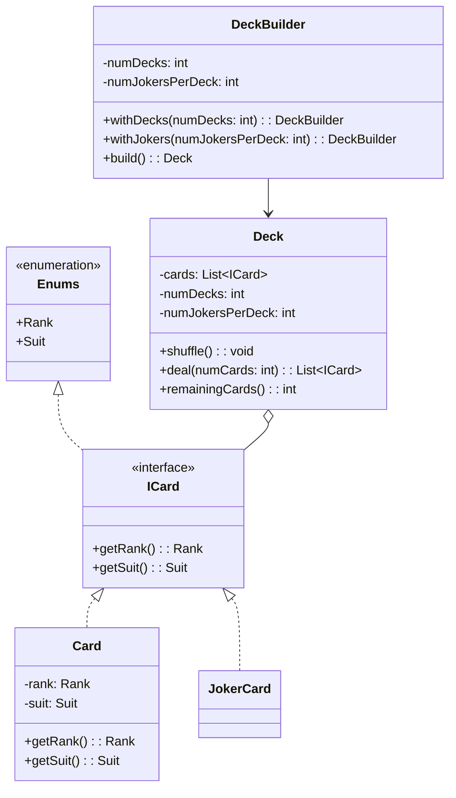

# Deck of Cards

Design a Deck of cards

## Clarification of Problem Statement

Design a reusable, extensible, and maintainable deck of cards system that works across different card games (Poker, Rummy, Bridge, Blackjack, etc.).

### Requirements

- Support standard 52-card decks with optional jokers
- Mix multiple decks together (for games requiring shoe configurations)
- Shuffle, deal, and burn cards
- Easy to extend with new card types without modifying existing code
- Each game can define its own rules while sharing the core deck functionality

### Constraints

- Deck composition should be immutable after creation (prevent bugs during gameplay)
- Jokers shouldn't have rank/suit properties
- System should work for any card game without modification

## Mermaid Diagram



### Design Benefits

✅ **Extensible**: New card types via ICard interface without modifying Deck
✅ **Reusable**: Same Deck works for Poker, Rummy, Bridge, Blackjack, etc.
✅ **Type-Safe**: Enums prevent invalid ranks/suits
✅ **Immutable**: Configuration locked after creation, prevents bugs
✅ **Builder Pattern**: Games configure decks fluently without code changes
✅ **SOLID Principles**: Single responsibility, Open/closed, Liskov substitution, etc.

## Implementation

### Core Classes

| Class | Purpose |
|-------|---------|
| `ICard` | Interface for all card types |
| `Card` | Regular card with rank and suit |
| `Joker` | Special card (no rank/suit) |
| `Rank` | Enum: ACE to KING |
| `Suit` | Enum: CLUB, DIAMOND, HEART, SPADE |
| `Deck` | Manages cards with shuffle, deal, burn operations |
| `DeckBuilder` | Fluent builder for deck configuration |

### Usage Example

```java
// Poker: Single standard deck
Deck pokerDeck = Deck.builder().build();

// Rummy: Two decks
Deck rummyDeck = Deck.builder().withDecks(2).build();

// Blackjack: 6-deck shoe
Deck shoeDeck = Deck.builder().withDecks(6).build();

// Custom: Multiple decks with jokers
Deck customDeck = Deck.builder()
    .withDecks(2)
    .withJokers(1)
    .build();

// Use the deck
customDeck.shuffle();
ICard card = customDeck.deal();
int remaining = customDeck.remainingCards();
```

---
