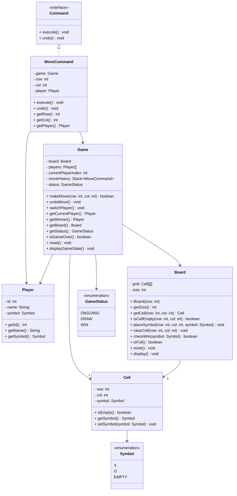

# Tic Tac Toe Game

Design a Tic Tac Toe game system with undo support.

## Problem Statement

Design a clean, maintainable Tic Tac Toe game system for two players on a 3x3 grid with undo/redo capabilities.

### Requirements

- Two players take turns placing symbols (X, O)
- Validate moves (prevent overwriting occupied cells)
- Detect win conditions (3 in a row/column/diagonal)
- Detect draw conditions (board full, no winner)
- Support undo operations
- Track current game state

## Class Diagram

## Design Explanation (Interview Style)

### Core Entities

- **`Game`** – Orchestrates turns, moves, and undo operations. Maintains command history.
- **`Board`** – Manages the 3x3 grid and provides move placement and win detection.
- **`Player`** – Holds player identity and symbol.
- **`Cell`** – Represents a single board position with row, column, and symbol.

### Command Pattern for Undo

- **`Command`** interface defines `execute()` and `undo()` contracts.
- **`MoveCommand`** implements:
  - `execute()` → places symbol on board
  - `undo()` → clears cell and reverts turn
- **`Game`** maintains a `Stack<Command>` for move history.

### Move Flow

`makeMove(r, c)` in `Game`:

1. Create `MoveCommand` with row, column, current player
2. Execute the command (places symbol)
3. Push command to stack
4. Switch to next player

### Undo Flow

`undoMove()`:

1. Pop command from stack
2. Call `undo()` to revert the move
3. Switch back to previous player

## Key Design Principles

✅ **Single Responsibility** – Each class has one reason to change  
✅ **Separation of Concerns** – Board handles state, Game handles flow  
✅ **Command Pattern** – Encapsulates moves for undo/redo support  
✅ **Clean & Testable** – No complex inheritance or factory patterns
