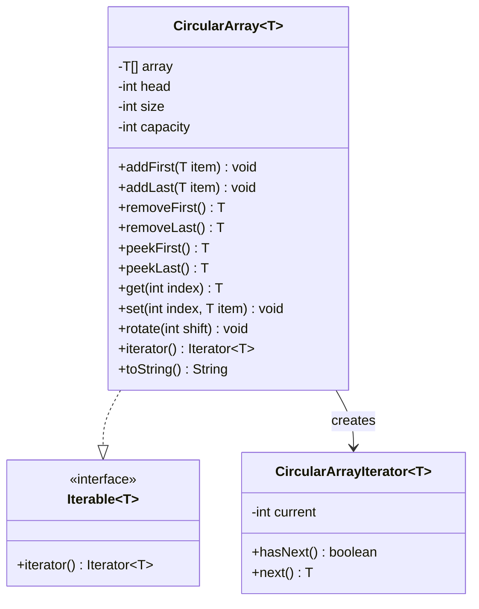

# Circular Array (Ring Buffer)

Design a generic circular array data structure.

## Problem Statement

Implement a circular array (ring buffer) that supports efficient O(1) operations
for adding/removing from both ends, random access, and rotation.

### Requirements

- Generic type support (`CircularArray<T>`)
- O(1) add/remove from front and back
- O(1) random access by logical index
- O(1) rotation in either direction (just moves the head pointer)
- Implements `Iterable<T>` for foreach loops
- Fixed capacity with overflow detection

### Key Design Decisions

- **Head pointer rotation**: Instead of physically shifting elements, rotation
  just adjusts the `head` index — O(1) instead of O(n)
- **Logical-to-physical mapping**: `get(i)` maps to `array[(head + i) % capacity]`
- **Always-positive modulo**: Java's `%` can return negative values, so we use
  `((a % m) + m) % m` to handle negative shifts correctly

## Class Diagram

## Design Benefits

✅ O(1) rotation via head pointer manipulation
✅ Generic — works with any type
✅ Iterable — supports enhanced for-loops
✅ Clean separation of logical vs physical indexing
✅ Defensive — bounds checking, capacity overflow detection

## Potential discussion points

- Why not use a dynamic array instead of fixed sized array? (like a Vector/ ArrayList with push back)
  Push back and pop back operations in arrays have an adverse effect - their insert and deletes are asymptotically O(1) but sometimes, if the allocated size of the array is less than the required size - the program needs to reallocate memory which is an O(n) operation. In contrast, a circular array with a fixed size does not require reallocation and can guarantee O(1) time complexity for insertions and deletions at both ends, as well as for random access and rotation. This makes it more efficient for scenarios where the maximum size is known in advance and memory management is a concern.
