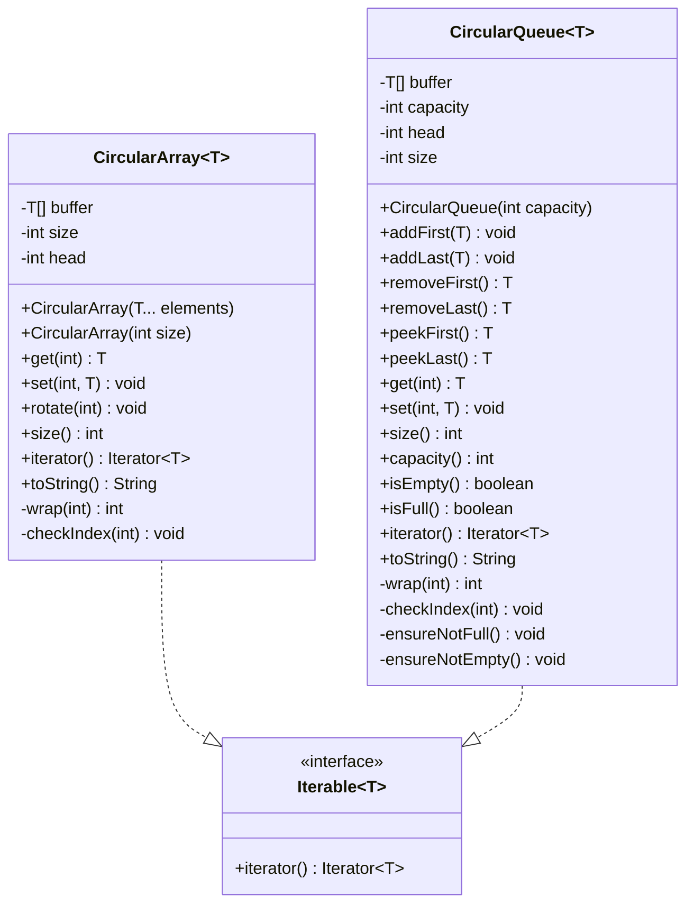

# Circular Array & Circular Queue

## Problem

Design a circular array.

This project implements **two** distinct data structures that both use the
same underlying trick — a fixed-size backing array with wrap-around indexing —
but serve different purposes.

---

## Core idea: wrap-around indexing

Both structures map a **logical** index to a **physical** slot via:

```
physical = (head + logical) % capacity
```

A movable `head` pointer decides where logical index 0 lives.  Java's `%`
can produce negative remainders, so the implementation normalises with
`((v % n) + n) % n` to keep the result in `[0, n)`.

---

## 1. CircularArray — the pure circular array

> Every slot is always occupied.  There is no concept of "empty" or "full" —
> you construct it with values, then `get`, `set`, and `rotate`.

### Operations (all O(1))

| Method | Description |
|--------|-------------|
| `get(int)` / `set(int, T)` | Random access by logical index |
| `rotate(int)` | Shift the logical view (positive = right, negative = left) |
| `size()` | Always equals capacity — every slot holds a value |
| `iterator()` | Walk elements in current logical order |

### Why no add / remove?

There are no uninitialised slots, so "adding" has no meaning.  You fill every
slot at construction time and then operate on the fixed set of elements.

---

## 2. CircularQueue — the bounded deque

> Size varies from 0 to capacity.  Elements are added/removed from both ends.
> Internally identical backing array, but with a `size` counter that tracks
> how many slots are occupied.

### Operations (all O(1))

| Method | Description |
|--------|-------------|
| `addFirst(T)` / `addLast(T)` | Insert at front / back |
| `removeFirst()` / `removeLast()` | Remove and return from front / back |
| `peekFirst()` / `peekLast()` | Read ends without removing |
| `get(int)` / `set(int, T)` | Random access within occupied range |
| `size()` / `capacity()` | Current count vs maximum |
| `isEmpty()` / `isFull()` | Boundary checks |
| `iterator()` | Walk occupied elements in logical order |

### Why no rotate?

When the buffer is partially filled, rotating the head pointer would map
logical indices onto uninitialised physical slots — so rotate is not offered.

---

## Side-by-side comparison

| Concern | CircularArray | CircularQueue |
|---------|---------------|---------------|
| Slots used | Always all of them | 0 to capacity |
| Core ops | `get`, `set`, `rotate` | `addFirst/Last`, `removeFirst/Last`, `peek` |
| Size tracking | Not needed (size == capacity) | Required (`size` field, 0..capacity) |
| Rotation | Supported (O(1)) | Not supported |
| Use case | Rotating logs, round-robin schedulers | Bounded task queues, sliding windows |

---

## Class diagram



---

## Key design decisions

### Head-pointer rotation (CircularArray)

Rotating a plain array is O(n) — every element must move.  Here, `rotate(k)`
just adjusts `head` by `k` positions: O(1), no copies.

### Always-positive modulo

Java's `%` can return a negative remainder (e.g. `-3 % 5 == -3`).
Both classes normalise with `((v % n) + n) % n` so the physical index is
always in `[0, capacity)`.

### Fixed capacity — no resizing

A resizable ring buffer (like `ArrayDeque`) occasionally copies the entire
backing array when it grows.  Fixed capacity guarantees **worst-case** O(1)
for every operation — important for latency-sensitive contexts like bounded
task queues or streaming buffers.
