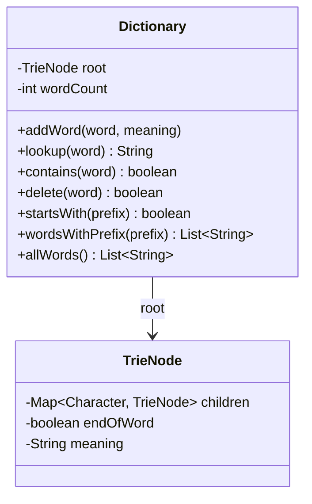

# Dictionary (Trie-based)

Design a dictionary data structure.

## Problem Statement

Implement a dictionary that supports word insertion with meanings,
lookup, deletion, prefix search, and autocomplete using a Trie.

### Requirements

- Add words with definitions
- Lookup word meaning in O(L) time
- Delete words (with node pruning)
- Find all words with a given prefix (autocomplete)
- Case-insensitive operations

## Class Diagram

## Design Benefits

✅ O(L) lookup/insert/delete where L = word length  
✅ Prefix-based autocomplete built-in  
✅ Node pruning on delete prevents memory leaks  
✅ Case-insensitive via normalization  
