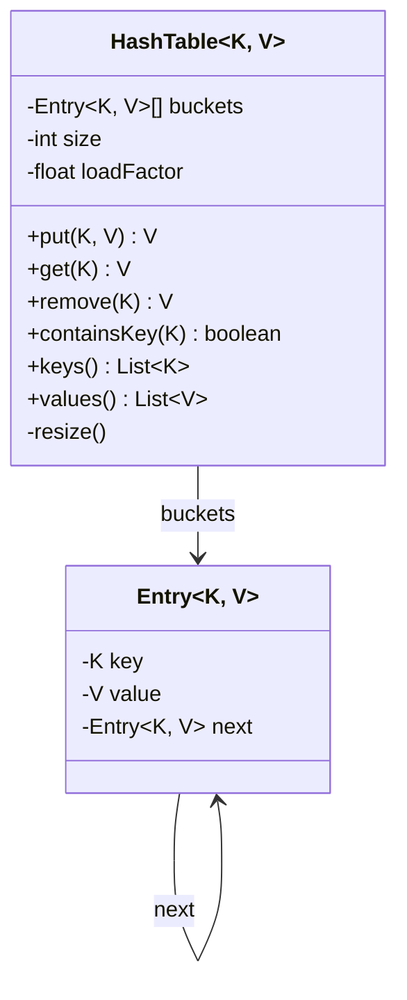

# Hash Table

Design a hash table from scratch.

## Problem Statement

Implement a generic hash table using separate chaining for collision resolution,
with automatic resizing.

### Requirements

- O(1) average `put`, `get`, `remove`
- Handle collisions using separate chaining (linked list per bucket)
- Auto-resize when load factor exceeds threshold (default 0.75)
- Support `keys()`, `values()`, `containsKey()`
- Reject null keys

## Class Diagram

## Design Benefits

✅ Separate chaining — simple, handles any number of collisions  
✅ Auto-resize — maintains O(1) amortized performance  
✅ Generic — works with any key/value types  
✅ Clean API — mirrors `java.util.Map` semantics  
