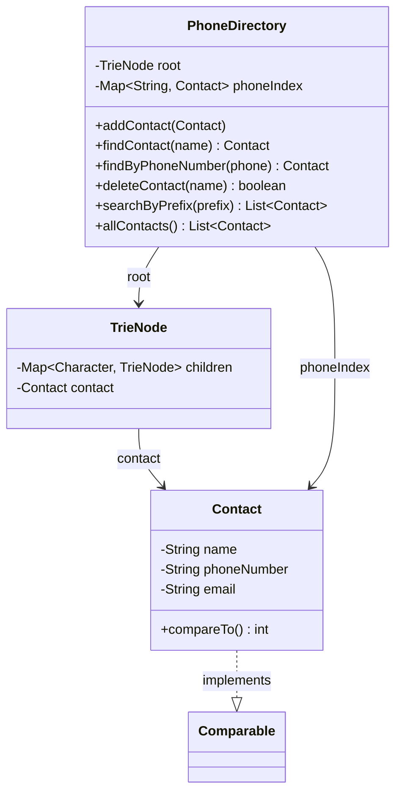

# Phone Directory

Design a phone directory system.

## Problem Statement

Implement a phone directory that supports adding, searching, updating, and deleting
contacts with prefix-based search (autocomplete) and reverse phone lookup.

### Requirements

- Add contacts (name, phone number, email)
- Exact name lookup
- Prefix-based search / autocomplete
- Reverse lookup by phone number
- Delete contacts
- Case-insensitive name operations
- All contacts listed alphabetically

## Class Diagram

## Design Benefits

✅ O(L) name lookup/search via Trie  
✅ O(1) reverse phone lookup via HashMap  
✅ Autocomplete built into prefix search  
✅ Sorted output for contact listing  
