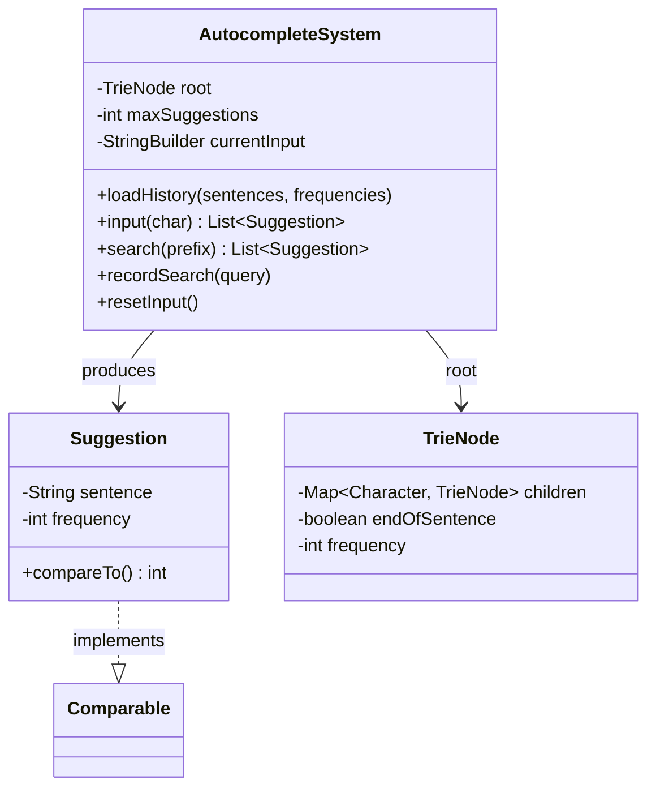

# Search Autocomplete System

Design a search autocomplete system (like Google search suggestions).

## Problem Statement

Implement a search autocomplete system that suggests top-k most frequently
searched sentences as the user types, character by character.

### Requirements

- Load historical search data with frequencies
- Return top-k suggestions for each character typed (ranked by frequency)
- Typing '#' signals end of search and records the query
- Case-insensitive
- Ties broken alphabetically
- Support both interactive (char-by-char) and one-shot prefix search

## Class Diagram

## Design Benefits

✅ O(L) prefix matching via Trie  
✅ Frequency-ranked suggestions  
✅ Interactive mode tracks position in Trie as user types  
✅ Automatic frequency tracking for new searches  
