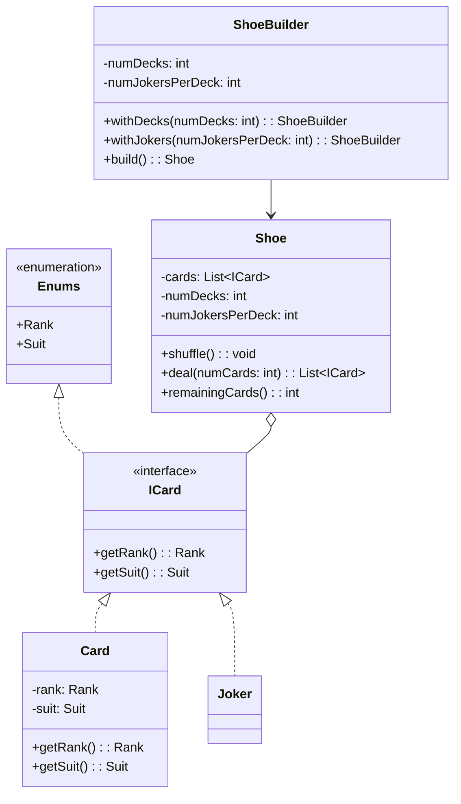

# Shoe of Cards

Design a Shoe of cards

## Clarification of Problem Statement

Design a reusable, extensible, and maintainable shoe of cards system that works across different card games (Poker, Rummy, Bridge, Blackjack, etc.).

### Requirements

- Support standard 52-card decks with optional jokers
- Mix multiple decks together (for games requiring shoe configurations)
- Shuffle, deal, and burn cards
- Easy to extend with new card types without modifying existing code
- Each game can define its own rules while sharing the core shoe functionality

### Constraints

- Shoe composition should be immutable after creation (prevent bugs during gameplay)
- Jokers shouldn't have rank/suit properties
- System should work for any card game without modification

## Mermaid Diagram

### Design Benefits

✅ **Extensible**: New card types via ICard interface without modifying Shoe
✅ **Reusable**: Same Shoe works for Poker, Rummy, Bridge, Blackjack, etc.
✅ **Type-Safe**: Enums prevent invalid ranks/suits
✅ **Immutable**: Configuration locked after creation, prevents bugs
✅ **Builder Pattern**: Games configure decks fluently without code changes
✅ **SOLID Principles**: Single responsibility, Open/closed, Liskov substitution, etc.
