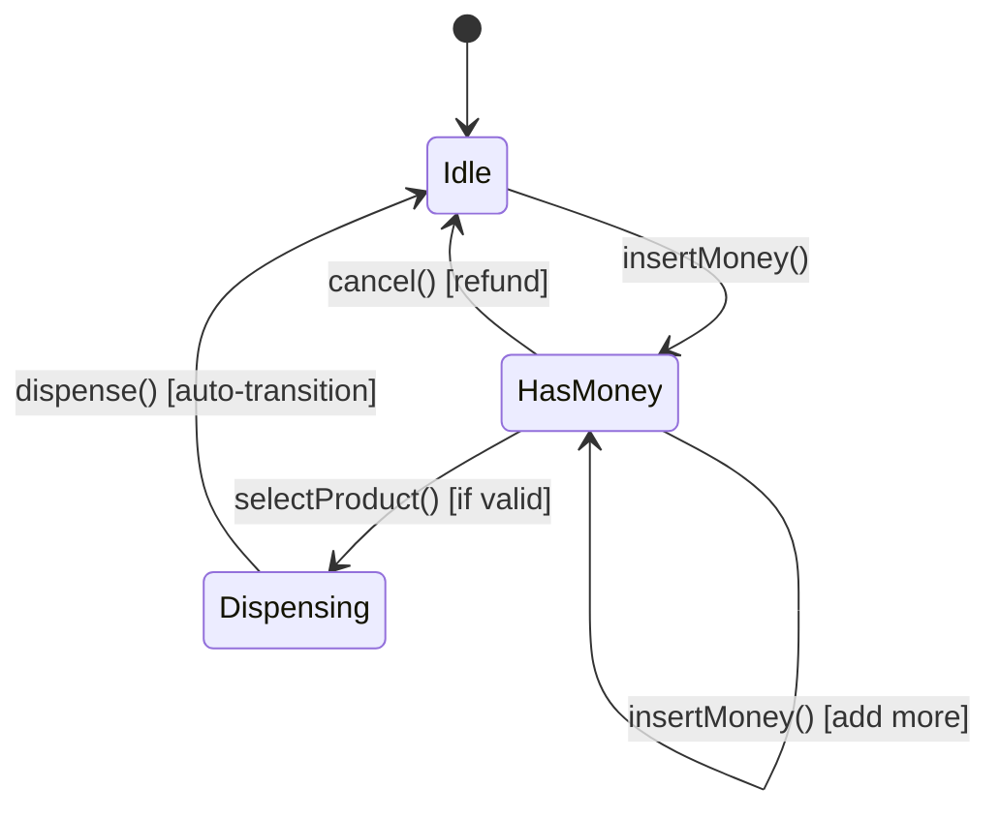
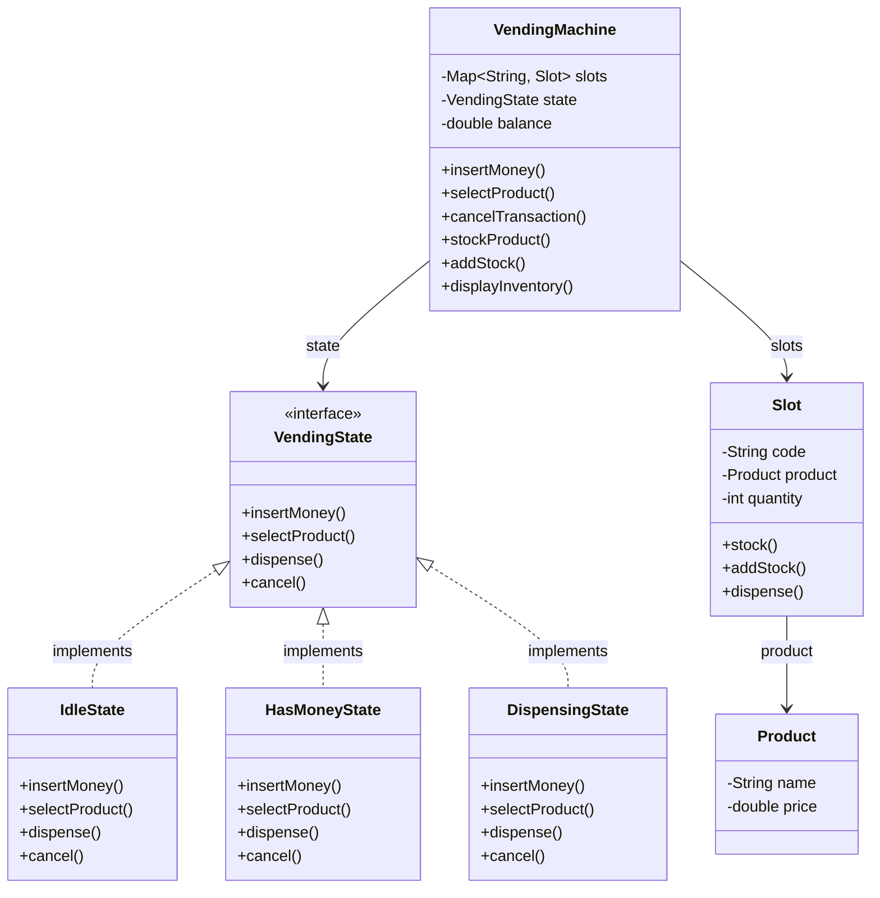

# Vending Machine

Design a vending machine using the State pattern.

## Problem Statement

Implement a vending machine that handles money insertion, product selection,
dispensing, change return, and cancellation with proper state management.

### Requirements

- Insert money (supports multiple insertions)
- Select product by slot code
- Dispense product and return change
- Cancel transaction for full refund
- Stock management (add products, check inventory)
- Proper state transitions (no invalid operations)

## State Diagram

## Class Diagram

## Design Benefits

✅ State Pattern — eliminates if/else chains for state management  
✅ Open/Closed — new states can be added without modifying existing ones  
✅ Clean API — actions delegate to current state  
✅ Inventory management built-in  
