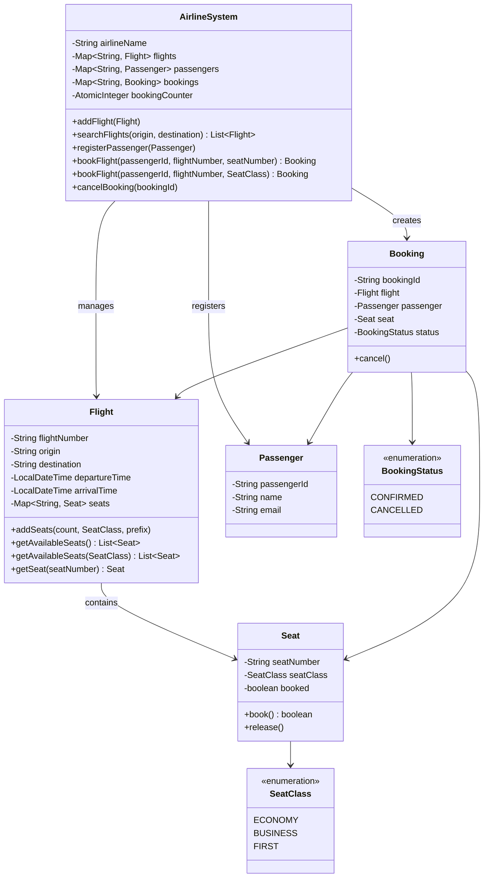

# Airline Management System

Design an airline management system.

## Problem Statement

Implement a system that manages flights, passengers, and bookings for an airline,
supporting flight search, seat selection, booking, and cancellation.

### Requirements

- Add flights with origin, destination, departure/arrival times
- Add seats per flight with different seat classes (Economy, Business, First)
- Register passengers with ID, name, and email
- Book flights by specific seat number or preferred seat class
- Cancel bookings (releases seat back to available pool)
- Search flights by origin and destination
- Track booking status (Confirmed / Cancelled)

### Key Design Decisions

- **LinkedHashMap** for flights, passengers, bookings — preserves insertion order
- **AtomicInteger** for booking ID generation — thread-safe counter
- **Seat availability filtering** uses Java Streams for clean, functional lookups
- **Overloaded `bookFlight()`** — book by specific seat or by preferred class

## Class Diagram

## Design Benefits

✅ Clean separation — Flight, Seat, Passenger, Booking each have single responsibilities
✅ Overloaded booking — supports both specific seat and class-based selection
✅ Stream-based filtering for available seats and flight search
✅ AtomicInteger for thread-safe booking ID generation

## Potential Discussion Points

- How would you handle concurrent bookings for the same seat? (Consider optimistic locking or CAS)
- How would you add pricing per seat class?
- How would you support multi-leg flights or connecting flights?
