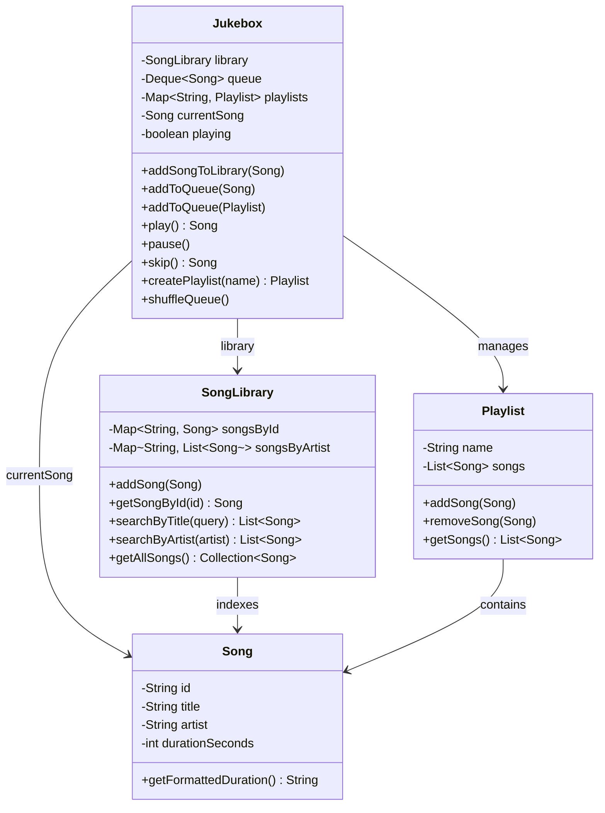

# Jukebox

Design a jukebox music player system.

## Problem Statement

Implement a jukebox that manages a song library, playlists, a play queue,
and supports playback controls (play, pause, skip, shuffle).

### Requirements

- Maintain a song library with search by title and artist
- Create named playlists and add songs to them
- Queue individual songs or entire playlists
- Playback controls: play, pause, skip
- Shuffle the queue
- Songs identified by ID, with title, artist, and duration

### Key Design Decisions

- **Deque for queue** — efficient add/remove from both ends
- **SongLibrary** encapsulates indexing by ID and artist (HashMap-based)
- **Playlist** is an immutable-view wrapper over an internal list
- **Separation of concerns** — Library (catalog), Playlist (grouping), Jukebox (playback orchestration)

## Class Diagram

## Design Benefits

✅ Clean separation — Library (storage), Playlist (grouping), Jukebox (orchestration)
✅ Dual-index search — songs indexed by both ID and artist for O(1) lookups
✅ Queue supports both single songs and bulk playlist additions
✅ Shuffle via `Collections.shuffle` on queue snapshot

## Potential Discussion Points

- How would you add repeat modes (repeat one, repeat all)?
- How would you persist playlist data across sessions?
- How would you support multiple concurrent users / remote playback?
