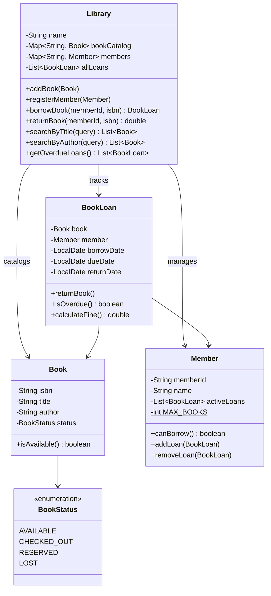

# Library Management System

Design a library management system.

## Problem Statement

Implement a library system that manages books, members, and lending operations
with support for borrowing, returning, fines, and search.

### Requirements

- Add books to catalog (ISBN, title, author)
- Register members with borrowing limits (max 5 books)
- Borrow and return books with due date tracking
- Calculate overdue fines ($0.50/day)
- Search books by title or author
- Track book status (Available, Checked Out, Reserved, Lost)
- List overdue loans

### Key Design Decisions

- **14-day loan period** with configurable fine rate
- **BookLoan** tracks borrow date, due date, return date, and calculates fines
- **Member borrowing limit** enforced before checkout
- **Book status enum** tracks lifecycle states

## Class Diagram

## Design Benefits

✅ Fine calculation encapsulated in `BookLoan` — single responsibility
✅ Member borrowing limit enforced at checkout time
✅ Stream-based search for title and author queries
✅ Overdue detection with lazy evaluation on access

## Potential Discussion Points

- How would you handle book reservations / hold queues?
- How would you support multiple copies of the same book?
- How would you add notification when a reserved book becomes available?
