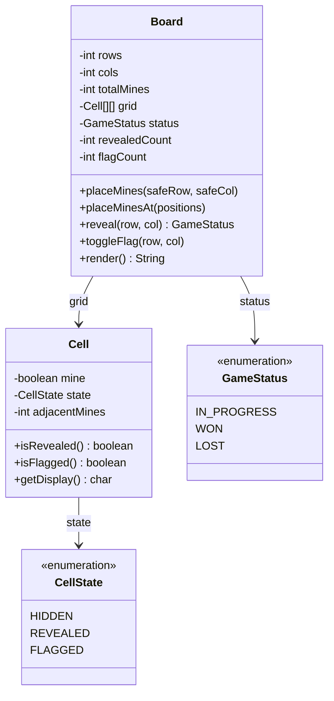

# Minesweeper

Design the Minesweeper game.

## Problem Statement

Implement the classic Minesweeper game with a grid board, mines, reveal/flag
mechanics, flood-fill for empty cells, and win/loss detection.

### Requirements

- Create a board with configurable rows, columns, and mine count
- Place mines randomly (avoiding first click) or at specific positions
- Reveal cells — mine = game over, zero adjacent = flood-fill
- Toggle flags on hidden cells
- Calculate adjacent mine counts
- Detect win condition (all non-mine cells revealed)
- Render board as text display

### Key Design Decisions

- **Flood-fill recursion** — revealing a cell with 0 adjacent mines automatically reveals all connected empty cells
- **Separate mine placement** — supports both random (with safe first-click) and deterministic (for testing)
- **CellState enum** — HIDDEN, REVEALED, FLAGGED — clean state management
- **Neighbor calculation** — 8-directional adjacency with bounds checking

## Class Diagram

## Design Benefits

✅ Flood-fill automatically reveals connected empty cells — natural recursive approach
✅ Deterministic mine placement for testing via `placeMinesAt()`
✅ Clean state machine — HIDDEN → REVEALED or FLAGGED with win/loss checks
✅ Text rendering for console-based play

## Potential Discussion Points

- How would you add difficulty levels (beginner, intermediate, expert)?
- How would you implement undo/redo for flag operations?
- How would you optimize flood-fill for very large boards? (BFS vs DFS)
