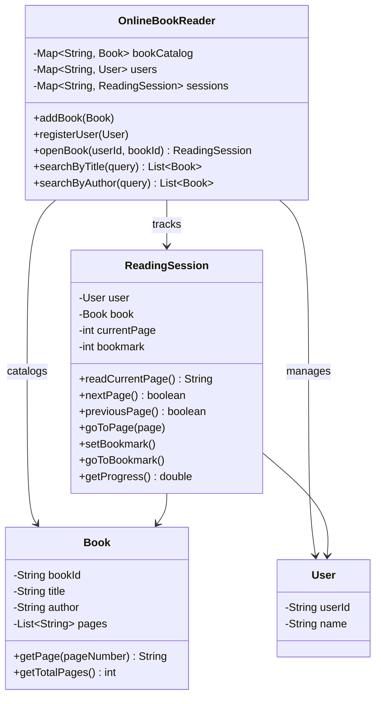

# Online Book Reader

Design an online book reader system.

## Problem Statement

Implement an online book reading platform that supports a book catalog,
user management, reading sessions with page navigation, bookmarks, and progress tracking.

### Requirements

- Maintain a book catalog with search by title and author
- Register users
- Open a book for reading (creates or resumes a session)
- Navigate pages: next, previous, go-to-page
- Set and return to bookmarks
- Track reading progress as percentage
- Support multiple users reading different books simultaneously

### Key Design Decisions

- **ReadingSession** per user-book pair — keyed by `"userId:bookId"` for O(1) lookup
- **Bookmark** as a simple page number — lightweight state
- **Book pages** stored as `List<String>` — each element is a page's content
- **Session resumption** — reopening a book returns the existing session (preserves position)

## Class Diagram

## Design Benefits

✅ Session resumption — reopening a book preserves reading position
✅ Composite key `userId:bookId` for efficient session lookup
✅ Progress tracking as simple percentage calculation
✅ Bookmark as lightweight state — single int field

## Potential Discussion Points

- How would you support highlights and annotations?
- How would you handle offline reading and sync?
- How would you add social features (reading groups, shared notes)?
