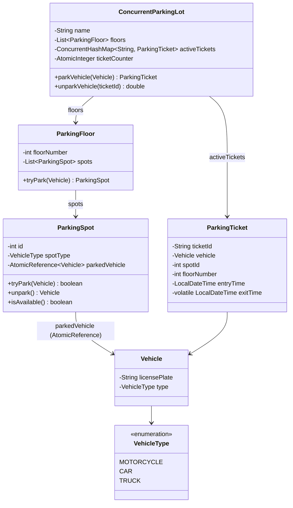

# Parking Lot (Multithreaded)

Design a thread-safe parking lot system.

## Problem Statement

Implement a concurrent parking lot that handles multiple vehicles entering and
exiting simultaneously without data races, using lock-free data structures.

### Requirements

- Thread-safe parking and unparking of vehicles
- Lock-free spot allocation using CAS (Compare-And-Swap)
- Multiple floors with motorcycle, car, and truck spots
- Concurrent ticket management
- No global locks — contention handled at individual spot level

### Key Design Decisions

- **AtomicReference for ParkingSpot** — `compareAndSet(null, vehicle)` for lock-free CAS-based parking
- **ConcurrentHashMap** for active tickets — thread-safe without explicit locking
- **AtomicInteger** for ticket counter — lock-free ID generation
- **No global lock** — each spot independently handles contention; failed CAS just tries the next spot

## Class Diagram

## Design Benefits

✅ Lock-free CAS on individual spots — no global contention bottleneck
✅ ConcurrentHashMap for tickets — thread-safe O(1) insert/remove
✅ AtomicInteger for ticket IDs — no synchronization needed
✅ Graceful rejection — returns null when lot is full, no exceptions

## Potential Discussion Points

- Why CAS over synchronized blocks? What are the trade-offs?
- How does `AtomicReference.compareAndSet(null, vehicle)` guarantee exactly one thread parks in a spot?
- When would you prefer `ReentrantLock` over lock-free CAS?
- How would you add fairness guarantees for vehicles waiting in a queue?
