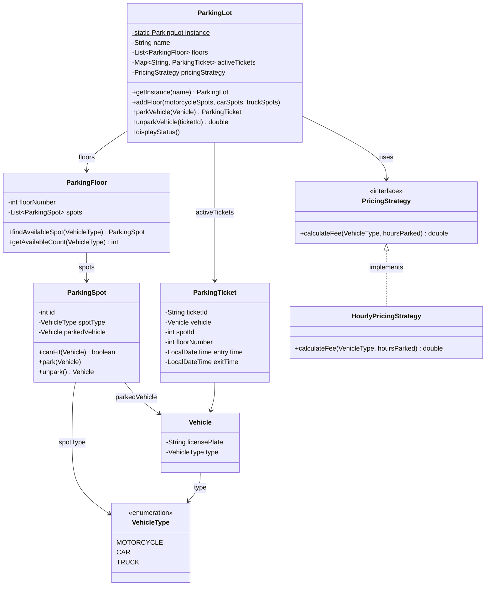

# Parking Lot

Design a multi-floor parking lot system.

## Problem Statement

Implement a parking lot system with multiple floors, different spot types,
ticket-based entry/exit, and strategy-based pricing.

### Requirements

- Multi-floor parking with motorcycle, car, and truck spots
- Ticket-based entry and exit
- Strategy pattern for pricing (hourly rates by vehicle type)
- Find available spot by vehicle type across floors
- Unpark with fee calculation based on duration
- Singleton pattern for the parking lot instance
- Display parking lot status

### Key Design Decisions

- **Singleton** — single parking lot instance across the application
- **Strategy pattern** for pricing — `PricingStrategy` interface with `HourlyPricingStrategy`
- **Vehicle type matching** — spots are typed, vehicles park only in matching spots
- **Ticket tracks** floor number and spot ID for O(1) unpark lookup

## Class Diagram

## Design Benefits

✅ Singleton ensures single parking lot instance
✅ Strategy pattern — easily swap pricing rules without changing core logic
✅ Multi-floor support with per-type spot availability
✅ Ticket-based tracking for clean entry/exit flow

## Potential Discussion Points

- Why Singleton here? What are the trade-offs vs dependency injection?
- How would you add support for reserved/handicapped spots?
- How would you handle concurrent entry/exit at scale? (See parking-lot-multithreaded)
