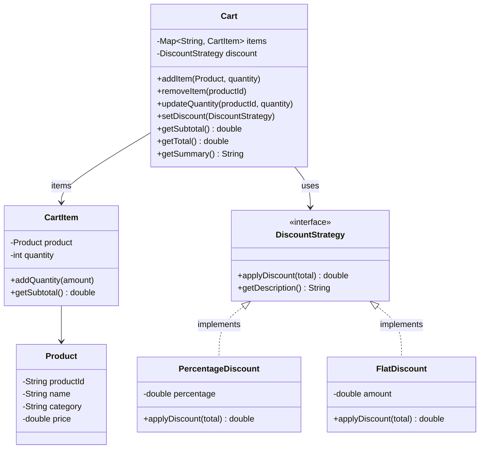

# Shopping Cart

Design a shopping cart system.

## Problem Statement

Implement a shopping cart that supports adding/removing products, quantity management,
and pluggable discount strategies (percentage-based, flat amount).

### Requirements

- Add products to cart with quantities
- Update quantities or remove items
- Calculate subtotal, discount, and final total
- Strategy pattern for discount rules
- Support percentage discount and flat discount
- Cart summary display

### Key Design Decisions

- **Strategy pattern** for discounts — `DiscountStrategy` interface with multiple implementations
- **LinkedHashMap** preserves insertion order for consistent cart display
- **CartItem** wraps product + quantity for clean encapsulation
- **Products identified by ID** — adding same product increments quantity

## Class Diagram

## Design Benefits

✅ Strategy pattern — swap discount logic at runtime without changing Cart code
✅ Open/Closed — add new discount types without modifying existing classes
✅ Quantity merging — adding same product increments existing CartItem
✅ Clean total calculation — subtotal → discount → final total pipeline

## Potential Discussion Points

- How would you support coupon codes and stacking multiple discounts?
- How would you add tax calculation per product category?
- How would you persist cart state across user sessions?
