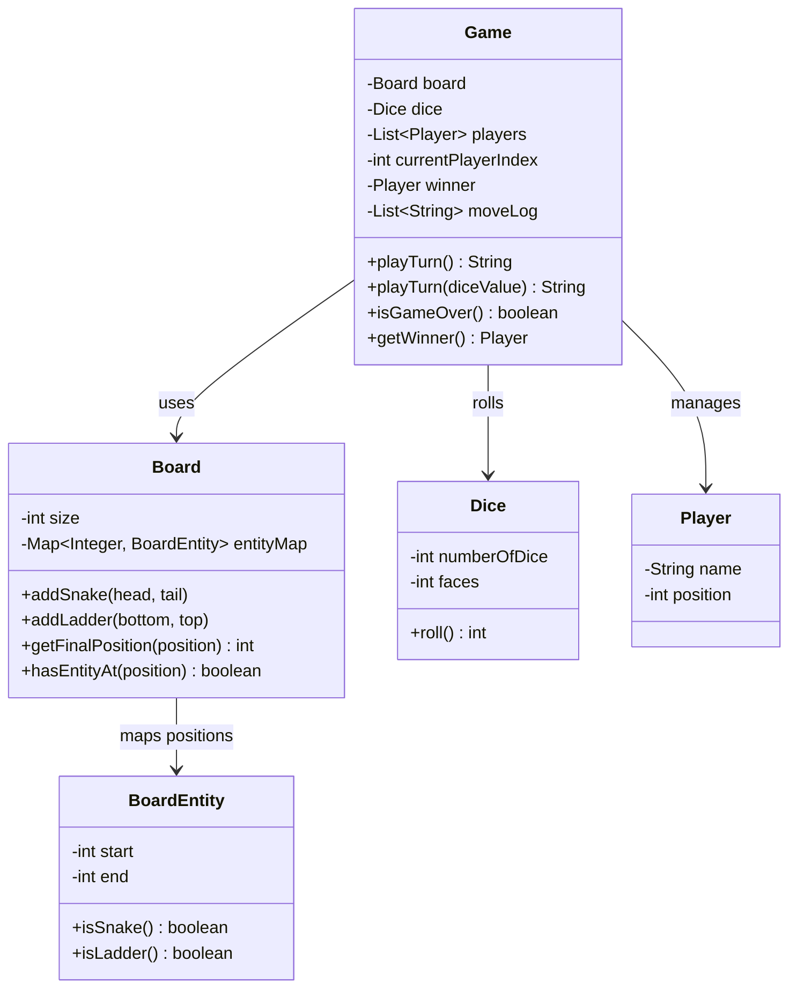

# Snake and Ladder

Design the Snake and Ladder board game.

## Problem Statement

Implement the classic Snake and Ladder game supporting multiple players,
configurable snakes/ladders, dice rolling, and win detection.

### Requirements

- Configurable board size (default 100)
- Add snakes (head > tail) and ladders (bottom < top) at specific positions
- Multiple players taking turns
- Dice rolling (configurable number of dice)
- Automatic snake/ladder application on landing
- Win detection when a player reaches the final cell
- Move log for game replay
- Cannot move beyond the board (bounce back if roll exceeds)

### Key Design Decisions

- **BoardEntity** — single class for both snakes and ladders; direction inferred from start vs end
- **Board maps positions** to entities via HashMap for O(1) lookup
- **Deterministic `playTurn(int)`** overload enables testing with known dice values
- **Turn-based** — players cycle via modular index

## Class Diagram

## Design Benefits

✅ Unified BoardEntity for snakes and ladders — direction inferred, no separate classes needed
✅ O(1) position-to-entity lookup via HashMap
✅ Testable — deterministic turn method accepts fixed dice values
✅ Move log enables game replay and debugging

## Potential Discussion Points

- How would you add special cells (e.g., extra turn, lose a turn)?
- How would you handle the variant where you must roll exact number to win?
- How would you make this multiplayer over a network?
