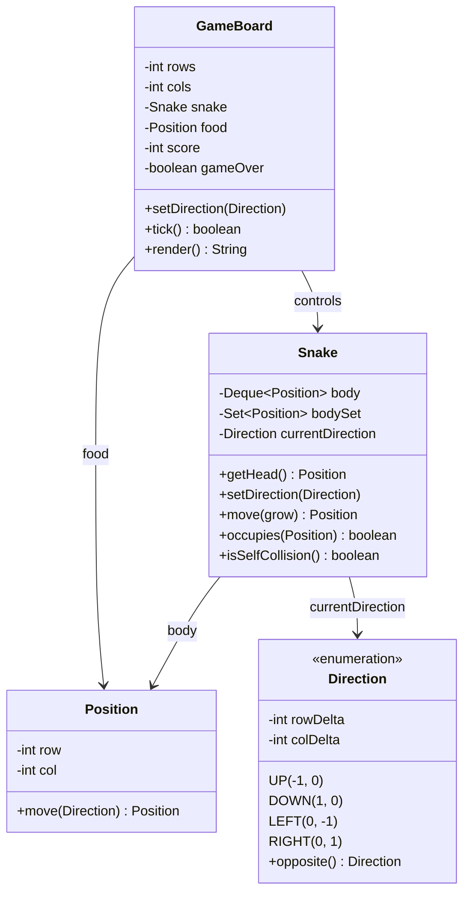

# Snake Game

Design the classic Snake game.

## Problem Statement

Implement the classic Snake game with a grid board, directional movement,
food spawning, growth mechanics, and collision detection (wall + self).

### Requirements

- Grid-based game board with configurable dimensions
- Snake moves in 4 directions (UP, DOWN, LEFT, RIGHT)
- Snake grows when eating food
- Food spawns randomly on empty cells
- Wall collision detection (game over)
- Self-collision detection (game over)
- Prevent 180-degree turns (can't reverse direction)
- Score tracking
- Text-based board rendering

### Key Design Decisions

- **Deque for snake body** — O(1) add to head, O(1) remove from tail
- **HashSet for body positions** — O(1) self-collision detection and food spawn validation
- **Position is immutable** — `move()` returns a new Position object
- **Direction enum** with deltas — encapsulates movement logic
- **Opposite direction check** prevents instant 180-degree reversal

## Class Diagram

## Design Benefits

✅ Deque + HashSet — O(1) movement and O(1) collision detection
✅ Immutable Position — safe to use in sets and as map keys
✅ Direction enum with deltas — clean movement calculation
✅ 180-degree turn prevention built into `setDirection()`

## Potential Discussion Points

- How would you add levels with increasing speed?
- How would you implement wrap-around walls instead of game-over on wall hit?
- How would you add obstacles or power-ups?
