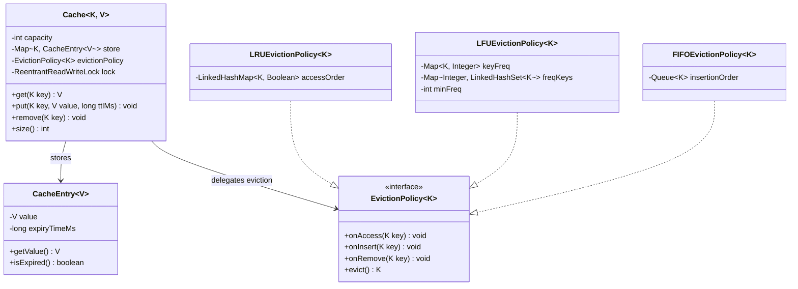

# Cache with Pluggable Eviction Policies

## Problem Statement
Design a generic, thread-safe cache that supports pluggable eviction strategies (LRU, LFU, FIFO) and optional TTL (time-to-live) per entry.

## Requirements
- Support `get`, `put`, and `remove` operations with O(1) average time
- Pluggable eviction policies via Strategy pattern
- TTL support — entries auto-expire after a configurable duration
- Thread-safe access using `ReentrantReadWriteLock`
- Bounded capacity with automatic eviction when full

## Key Design Decisions
- **Strategy Pattern** — `EvictionPolicy<K>` interface allows swapping eviction behavior (LRU, LFU, FIFO) without changing the cache core
- **LRU via LinkedHashMap** (access-order mode) — O(1) eviction of the least-recently-used key
- **LFU via frequency buckets** — `Map<Integer, LinkedHashSet<K>>` tracks keys per frequency; ties broken by insertion order
- **FIFO via Queue** — simple `LinkedList` queue evicts the oldest inserted key
- **TTL via CacheEntry wrapper** — each entry records its expiry time; expired entries are evicted on access
- **ReentrantReadWriteLock** — read lock for `get`, write lock for `put`/`remove`, enabling concurrent reads

## Class Diagram

## Design Benefits
- ✅ **Open/Closed Principle** — new eviction strategies added without modifying Cache
- ✅ **Thread-safe** — `ReentrantReadWriteLock` allows concurrent reads with exclusive writes
- ✅ **TTL support** — per-entry expiry without background cleanup threads
- ✅ **Generic types** — works with any key/value types
- ✅ **Clean separation** — cache core is decoupled from eviction logic

## Potential Discussion Points
- How would you add a background thread for proactive TTL cleanup?
- How to add cache statistics (hit rate, eviction count)?
- How would you implement a distributed cache across multiple nodes?
- Write-through vs write-behind caching strategies
- How to handle cache stampede (thundering herd) on expiry?
