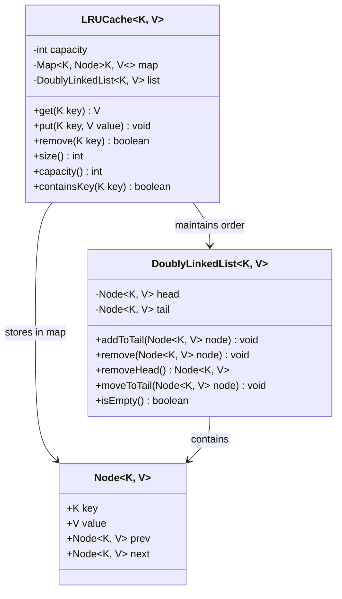

# LRU Cache (From Scratch)

## Problem Statement
Design a Least Recently Used (LRU) Cache with O(1) `get` and `put` operations, built from scratch using a custom doubly-linked list and HashMap.

## Requirements
- O(1) time complexity for both `get` and `put`
- Automatic eviction of the least-recently-used entry when capacity is exceeded
- Support for `remove`, `size`, and `containsKey` operations
- No dependency on `LinkedHashMap` — implement the linked list manually

## Key Design Decisions
- **Doubly-Linked List + HashMap** — the classic LRU implementation for O(1) access and order maintenance
- **Sentinel head/tail nodes** — eliminates null checks and simplifies insertion/removal at boundaries
- **Head = LRU, Tail = MRU** — `removeHead()` evicts least-recently-used; `addToTail()` marks most-recently-used
- **`moveToTail()` on access** — every `get` or `put` to an existing key refreshes its position

## Class Diagram

## Design Benefits
- ✅ **O(1) operations** — HashMap provides direct node access; linked list provides O(1) reordering
- ✅ **No library dependency** — custom doubly-linked list demonstrates understanding of data structures
- ✅ **Sentinel nodes** — clean boundary handling without special cases
- ✅ **Generic types** — works with any key/value pair

## Potential Discussion Points
- How does this compare to using `LinkedHashMap` with `removeEldestEntry`?
- How would you make this thread-safe?
- How to extend this to support TTL (time-to-live) per entry?
- How would you implement an LFU cache with O(1) operations?
- How to handle cache warm-up in a distributed system?
