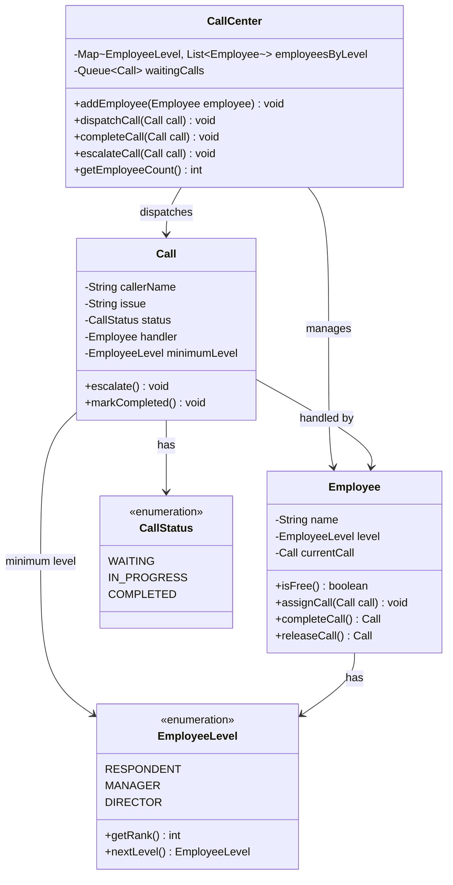

# Call Center

## Problem Statement
Design a call center system with multi-level employee routing. Incoming calls should be dispatched to available employees starting from the lowest level and escalated upward when needed.

## Requirements
- Three employee levels: Respondent → Manager → Director
- Automatic routing to the first available employee at the lowest appropriate level
- Call escalation to the next level when lower levels cannot handle the call
- Call queue for when all employees at all levels are busy
- Automatic dispatch of queued calls when an employee becomes free

## Key Design Decisions
- **Chain of Responsibility** — calls start at RESPONDENT level and escalate through MANAGER to DIRECTOR
- **EnumMap for level-based grouping** — `Map<EmployeeLevel, List<Employee>>` provides fast lookup by level
- **FIFO waiting queue** — overflow calls are held and dispatched in order when employees free up
- **Enum with rank** — `EmployeeLevel` has a numeric rank for level comparison during escalation
- **Employee state tracking** — each employee knows if they're free or on a call

## Class Diagram

## Design Benefits
- ✅ **Chain of Responsibility** — clean escalation path through employee levels
- ✅ **Automatic dispatch** — freed employees automatically pick up queued calls
- ✅ **Escalation support** — calls can be escalated to higher levels mid-handling
- ✅ **Extensible levels** — new employee levels can be added to the enum

## Potential Discussion Points
- How would you add skill-based routing (e.g., billing vs technical)?
- How to handle priority calls (VIP customers)?
- How to add metrics tracking (average wait time, resolution time)?
- How would you make this thread-safe for concurrent call dispatch?
- How to implement call-back when queue wait exceeds a threshold?
