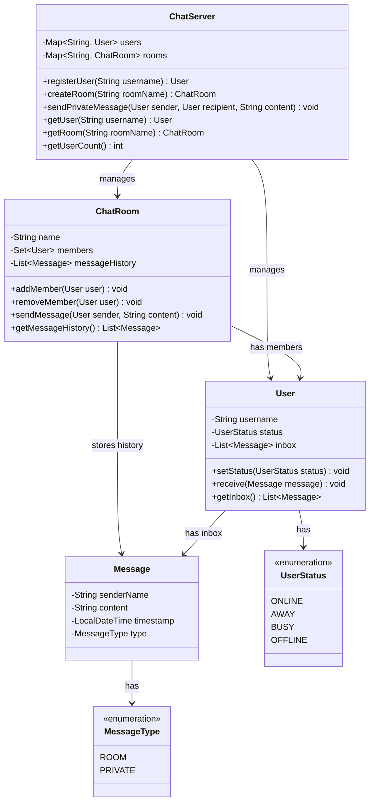

# Chat Server

## Problem Statement
Design a chat server system supporting user registration, chat rooms with join/leave/broadcast, private messaging, and message history.

## Requirements
- User registration with unique usernames and status management (Online, Away, Busy, Offline)
- Chat rooms that users can join, leave, and send messages to
- Private (direct) messaging between users
- Message history per room
- User inbox for received messages

## Key Design Decisions
- **Mediator Pattern** — `ChatServer` acts as a central coordinator for all communication
- **Observer Pattern** — room members are notified when messages are sent to the room
- **Immutable messages** — `Message` objects are value objects with timestamps
- **Message types** — `ROOM` vs `PRIVATE` differentiate broadcast from direct messages
- **LinkedHashSet for members** — preserves join order while preventing duplicates

## Class Diagram

## Design Benefits
- ✅ **Mediator Pattern** — centralized communication reduces coupling between users and rooms
- ✅ **Observer Pattern** — room members automatically notified of new messages
- ✅ **Clean separation** — users, rooms, and messages are independent entities
- ✅ **Message history** — both rooms and users maintain their own message records
- ✅ **Status management** — users can indicate availability

## Potential Discussion Points
- How would you add real-time WebSocket-based message delivery?
- How to implement message encryption for private messages?
- How to handle offline message delivery (store-and-forward)?
- How to add admin roles and moderation (mute, kick, ban)?
- How would you scale this to millions of concurrent users?
