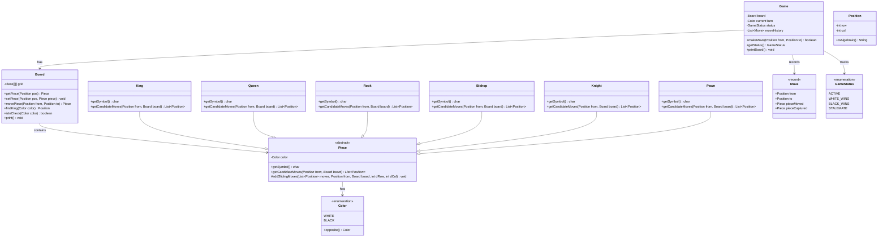

# Chess Game

## Problem Statement
Design a fully functional chess game with all standard pieces, legal move validation, turn-based play, and check/checkmate detection.

## Requirements
- 8x8 board with all standard chess pieces (King, Queen, Rook, Bishop, Knight, Pawn)
- Legal move validation per piece type (including pawn double-step and diagonal capture)
- Turn-based play alternating between White and Black
- Check detection — warn when a king is under attack
- Checkmate and stalemate detection
- Move history tracking

## Key Design Decisions
- **Polymorphism** — abstract `Piece` class with subclasses for each piece type; each piece generates its own candidate moves
- **Two-phase move validation** — pieces generate raw candidate moves, then `Game` filters out moves that would leave own king in check
- **Sliding piece helper** — shared `addSlidingMoves()` method for Rook, Bishop, and Queen directional movement
- **Record for Move** — immutable `Move` record captures from, to, piece moved, and piece captured
- **Position as value object** — `Position` with algebraic notation display (`e4`, `d7`)
- **Simulation-based check detection** — temporarily execute a move, test for check, then undo

## Class Diagram

## Design Benefits
- ✅ **Polymorphism** — each piece encapsulates its own movement logic
- ✅ **Template Method** — `addSlidingMoves` shared by Rook, Bishop, Queen
- ✅ **Separation of concerns** — Board handles state, Pieces handle movement, Game handles rules
- ✅ **Immutable records** — `Move` captures game history without mutation risks
- ✅ **Algebraic notation** — positions display in standard chess format

## Potential Discussion Points
- How would you add castling and en passant?
- How to implement pawn promotion?
- How to add an AI opponent (minimax with alpha-beta pruning)?
- How to implement undo/redo (Memento or Command pattern)?
- How would you serialize game state for save/load?
