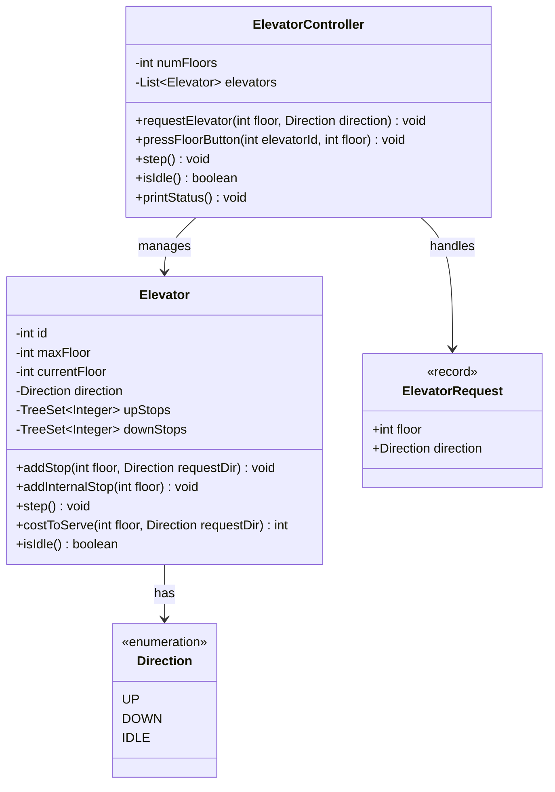

# Elevator System

## Problem Statement
Design a multi-elevator system for a building with request scheduling, nearest-elevator dispatching, and SCAN (elevator) scheduling.

## Requirements
- Multiple elevators operating independently in a multi-floor building
- External requests (floor buttons) and internal requests (cabin buttons)
- Nearest-elevator dispatching — assign the cheapest elevator to serve a request
- SCAN scheduling — each elevator services floors in its current direction, then reverses
- Step-based simulation for demonstration

## Key Design Decisions
- **SCAN (Elevator) Algorithm** — elevator travels in one direction servicing all stops, then reverses (like a disk arm)
- **TreeSet for stops** — separate `upStops` and `downStops` provide ordered traversal and O(log n) insertion
- **Cost-based dispatching** — `costToServe()` calculates distance considering current direction and pending stops
- **Direction enum** — UP, DOWN, IDLE cleanly represent elevator state
- **ElevatorRequest record** — immutable value object for external requests

## Class Diagram

## Design Benefits
- ✅ **SCAN scheduling** — efficient floor servicing minimizing direction changes
- ✅ **Cost-based dispatching** — optimal elevator selection based on proximity and direction
- ✅ **TreeSet for stops** — ordered stops enable efficient direction-based traversal
- ✅ **Separation of concerns** — Controller handles dispatch, Elevator handles scheduling
- ✅ **Step-based simulation** — easy to trace and debug elevator behavior

## Potential Discussion Points
- How would you handle express elevators (skip certain floors)?
- How to implement a weight/capacity limit per elevator?
- How to optimize for peak hours (e.g., morning rush to upper floors)?
- What about LOOK vs SCAN algorithm differences?
- How to handle elevator maintenance mode?
