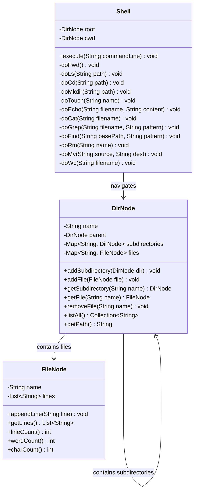

# File System with Unix Commands

## Problem Statement
Design an in-memory file system with a Unix-like shell that supports standard commands: `pwd`, `ls`, `cd`, `mkdir`, `touch`, `echo`, `cat`, `grep`, `find`, `rm`, `mv`, `wc`.

## Requirements
- In-memory directory tree with files containing line-based content
- Working directory tracking with `cd` (supports relative and absolute paths)
- File operations: create (`touch`), write (`echo`), read (`cat`), delete (`rm`), move/rename (`mv`)
- Directory operations: create (`mkdir`), list (`ls`), navigate (`cd`)
- Search: `grep` for content matching, `find` for filename matching
- Statistics: `wc` for line/word/character count

## Key Design Decisions
- **Command Pattern** — shell interprets text commands and dispatches to handler methods
- **DirNode/FileNode separation** — directories contain maps of subdirectories and files separately
- **Line-based file content** — files store content as `List<String>` for easy grep and wc operations
- **Relative and absolute paths** — `cd`, `mkdir`, `find` support both path types
- **Parent tracking** — each directory knows its parent for `cd ..` navigation

## Class Diagram

## Design Benefits
- ✅ **Command Pattern** — clean dispatch from text commands to operations
- ✅ **Familiar Unix interface** — intuitive command set for filesystem operations
- ✅ **Line-based content** — natural fit for grep, cat, and wc operations
- ✅ **Path resolution** — supports both relative and absolute paths with `..` navigation
- ✅ **Separation of concerns** — Shell handles parsing, DirNode/FileNode handle data

## Potential Discussion Points
- How would you add piping between commands (e.g., `cat file | grep pattern`)?
- How to implement tab completion?
- How to add file permissions and user ownership?
- How would you implement `cp` with deep copy for directories?
- How to add command history and arrow-key navigation?
