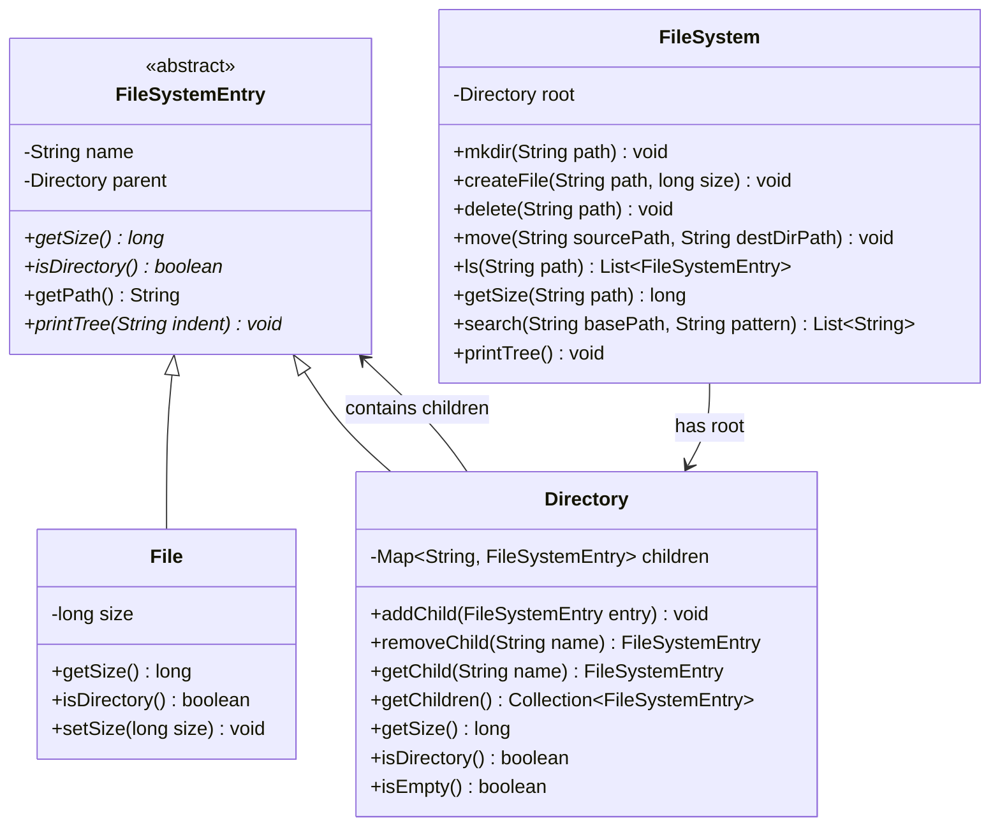

# File System

## Problem Statement
Design an in-memory hierarchical file system supporting directories, files, path-based navigation, and operations like create, delete, move, and search.

## Requirements
- Hierarchical directory structure with nested directories and files
- Path-based navigation (absolute paths)
- Create directories (`mkdir -p` behavior) and files with sizes
- Delete files and directories
- Move entries between directories
- List directory contents
- Search files by glob pattern (e.g., `*.txt`)
- Recursive size calculation for directories
- Tree display

## Key Design Decisions
- **Composite Pattern** — `FileSystemEntry` is the abstract component; `File` is the leaf, `Directory` is the composite
- **Path resolution** — walk the directory tree by splitting the path on `/`
- **LinkedHashMap for children** — preserves insertion order while providing O(1) name-based lookup
- **Recursive size** — directory size is the sum of all descendant file sizes
- **Simple glob matching** — supports `*.ext` and exact name matching

## Class Diagram

## Design Benefits
- ✅ **Composite Pattern** — uniform treatment of files and directories
- ✅ **Recursive operations** — size, search, and tree display naturally recurse through the composite
- ✅ **Path-based API** — familiar filesystem interface with absolute paths
- ✅ **`mkdir -p` behavior** — creates intermediate directories automatically
- ✅ **Extensible** — easy to add permissions, timestamps, or file content

## Potential Discussion Points
- How would you add file permissions (read/write/execute)?
- How to implement symbolic links (symlinks)?
- How to handle concurrent access to the file system?
- How would you persist this to disk?
- How to add file content (read/write bytes)?
