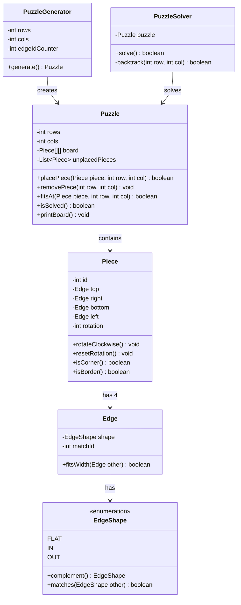

# Jigsaw Puzzle

## Problem Statement
Design a jigsaw puzzle game with edge-matching pieces, rotation support, puzzle generation, and an automatic backtracking solver.

## Requirements
- Grid-based puzzle board (NxM) with interlocking pieces
- Each piece has 4 edges: top, right, bottom, left
- Edge shapes: FLAT (borders), IN (concave), OUT (convex) — IN pairs with OUT
- Flat edges must be on puzzle borders
- Piece rotation (0°, 90°, 180°, 270°)
- Puzzle generator that creates solvable puzzles with shuffled, rotated pieces
- Backtracking solver

## Key Design Decisions
- **Edge matching** — complementary shapes (IN↔OUT) with matching IDs ensure unique pairing
- **Piece rotation** — `rotateClockwise()` cycles edges: top←left, left←bottom, bottom←right, right←top
- **Backtracking solver** — tries each unplaced piece at each rotation at the next empty cell
- **PuzzleGenerator** — creates a solved grid first, assigns matching edge IDs, then shuffles and rotates pieces
- **Corner/border detection** — pieces classify themselves by counting FLAT edges (2=corner, 1=border)

## Class Diagram

## Design Benefits
- ✅ **Edge-based matching** — realistic puzzle mechanics with shape complementarity
- ✅ **Rotation support** — pieces can be placed in any of 4 orientations
- ✅ **Generator/Solver separation** — puzzle creation and solving are independent
- ✅ **Backtracking solver** — exhaustive search guarantees finding a solution if one exists
- ✅ **Self-classifying pieces** — corner/border detection aids solver optimization

## Potential Discussion Points
- How would you optimize the solver (constraint propagation, pruning)?
- How to handle puzzles with multiple valid solutions?
- How to add a GUI for interactive puzzle solving?
- How would you generate puzzles from images (cutting an image into pieces)?
- How to parallelize the solver for large puzzles?
