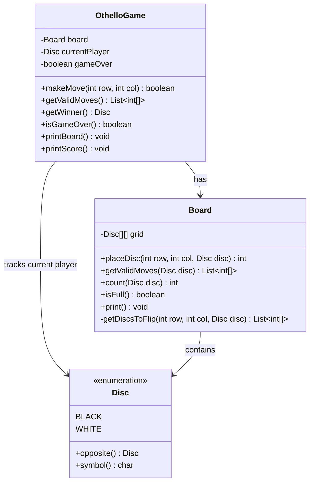

# Othello (Reversi)

## Problem Statement
Design an Othello (Reversi) game with an 8x8 board, legal move validation, disc flipping, and game-over detection.

## Requirements
- 8x8 board with standard initial setup (2 Black, 2 White discs in center)
- Legal move validation — a move must flip at least one opponent disc
- Disc flipping in all 8 directions (horizontal, vertical, diagonal)
- Turn management — Black moves first; turn passes if no valid moves
- Score tracking (count of Black vs White discs)
- Game-over detection — when neither player can move or board is full

## Key Design Decisions
- **8-directional scanning** — `DIRECTIONS` array of `{dRow, dCol}` offsets scans all 8 directions for captures
- **Flip validation** — a direction is valid only if it contains a contiguous line of opponent discs terminated by own disc
- **Auto-pass** — if the current player has no valid moves, turn passes to opponent automatically
- **Disc enum** — `BLACK` and `WHITE` with `opposite()` for clean turn switching
- **Board encapsulation** — Board handles disc placement and flipping; Game handles turns and rules

## Class Diagram

## Design Benefits
- ✅ **Clean directional scanning** — single array drives all 8 capture directions
- ✅ **Board encapsulation** — placement, flipping, and validation are internal to Board
- ✅ **Auto-pass logic** — handles edge cases where one player has no moves
- ✅ **Simple scoring** — disc counting is straightforward and efficient
- ✅ **Separation of rules and state** — Game handles rules, Board handles state

## Potential Discussion Points
- How would you add an AI opponent (minimax, alpha-beta pruning)?
- How to implement move suggestions highlighting valid cells?
- How to add undo/redo functionality?
- How would you implement a tournament mode with ELO ratings?
- How to optimize move validation for performance?
