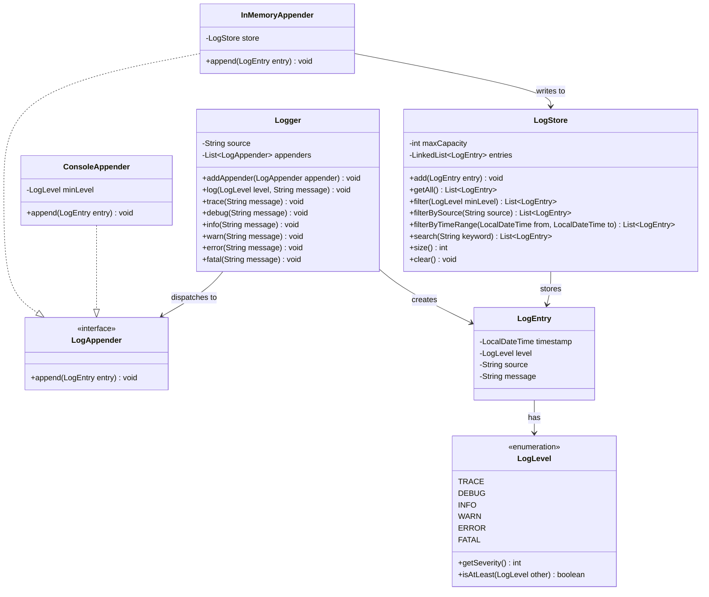

# Log Storage System

## Problem Statement
Design a structured logging system with multiple log levels, pluggable appenders, in-memory storage with rotation, and search/filter capabilities.

## Requirements
- Log levels: TRACE, DEBUG, INFO, WARN, ERROR, FATAL (ordered by severity)
- Structured log entries with timestamp, level, source, and message
- Multiple appenders — Console (with minimum level filter) and InMemory
- In-memory storage with capacity-based rotation (oldest entries discarded)
- Filter by level, source, time range, and keyword search
- Thread-safe logging

## Key Design Decisions
- **Strategy Pattern** — `LogAppender` interface allows pluggable log destinations (console, memory, file, etc.)
- **Logger dispatches to appenders** — each logger has a source name and fans out entries to all registered appenders
- **ConsoleAppender with minimum level** — only prints entries at or above a threshold (e.g., INFO+)
- **InMemoryAppender with LogStore** — stores entries in a bounded `LinkedList` for search/filter
- **Capacity-based rotation** — when the store reaches max capacity, oldest entries are evicted (ring buffer behavior)
- **Synchronized methods** — `LogStore` is thread-safe for concurrent logging

## Class Diagram

## Design Benefits
- ✅ **Strategy Pattern** — easily add new appenders (file, database, remote) without modifying Logger
- ✅ **Level-based filtering** — ConsoleAppender suppresses low-severity logs
- ✅ **Capacity-based rotation** — bounded memory usage with automatic oldest-entry eviction
- ✅ **Rich query API** — filter by level, source, time range, and keyword
- ✅ **Thread-safe** — synchronized LogStore methods for concurrent access

## Potential Discussion Points
- How would you add asynchronous logging (non-blocking log calls)?
- How to implement log aggregation across multiple services?
- How to add structured fields (key-value metadata) to log entries?
- How would you implement a rolling file appender?
- How to add log sampling for high-throughput systems?
