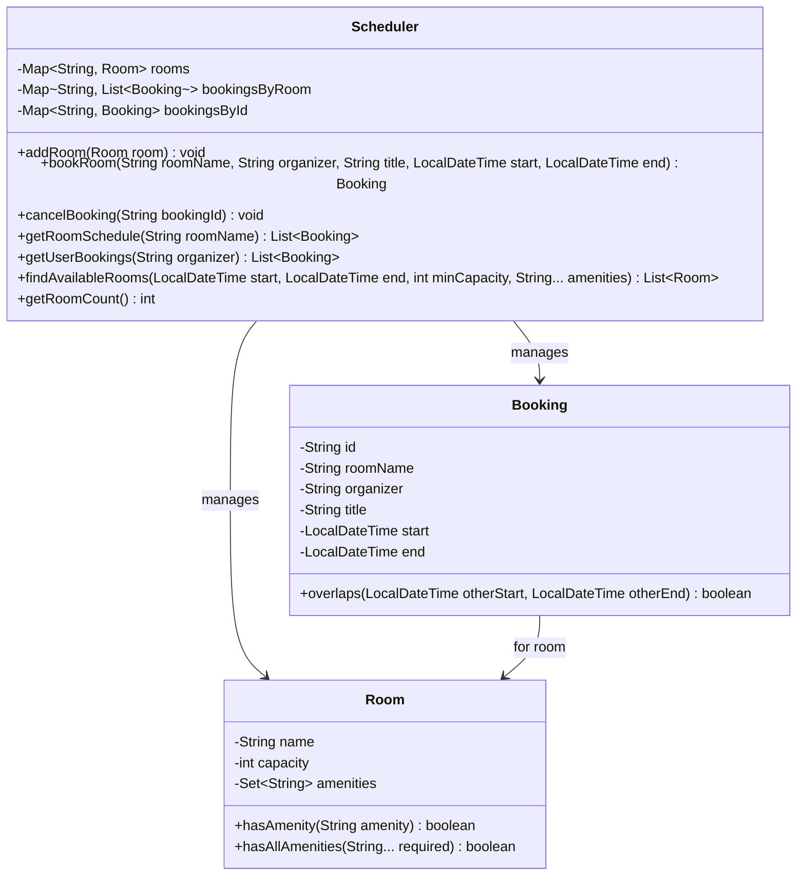

# Meeting Room Scheduler

## Problem Statement
Design a meeting room scheduling system that manages rooms with different capacities and amenities, handles bookings with conflict detection, and supports availability queries.

## Requirements
- Multiple rooms with different capacities and amenities (projector, whiteboard, video-conference)
- Booking with conflict detection — no double-booking allowed
- Cancel bookings
- Find available rooms by time slot, minimum capacity, and required amenities
- View schedules per room and per user
- Unique booking IDs via UUID

## Key Design Decisions
- **Overlap detection** — `Booking.overlaps()` uses interval overlap logic: `start < otherEnd && end > otherStart`
- **Room amenities as Set** — `hasAllAmenities()` checks if a room has all required amenities
- **Three lookup maps** — `rooms` by name, `bookingsByRoom` by room name, `bookingsById` for cancellation
- **Synchronized booking** — thread-safe `bookRoom()` and `cancelBooking()` methods prevent race conditions
- **UUID-based booking IDs** — unique identifiers for each booking

## Class Diagram

## Design Benefits
- ✅ **Conflict detection** — interval overlap logic prevents double-booking
- ✅ **Multi-criteria search** — filter by time, capacity, and amenities simultaneously
- ✅ **Thread-safe** — synchronized methods for concurrent booking operations
- ✅ **UUID-based IDs** — unique booking identifiers for cancellation and lookup
- ✅ **Flexible amenities** — Set-based amenity matching supports arbitrary room features

## Potential Discussion Points
- How would you add recurring meetings (daily, weekly)?
- How to implement buffer time between meetings?
- How to handle room preferences and auto-suggestion?
- How would you implement waiting lists for popular rooms?
- How to add calendar integration (iCal, Google Calendar)?
