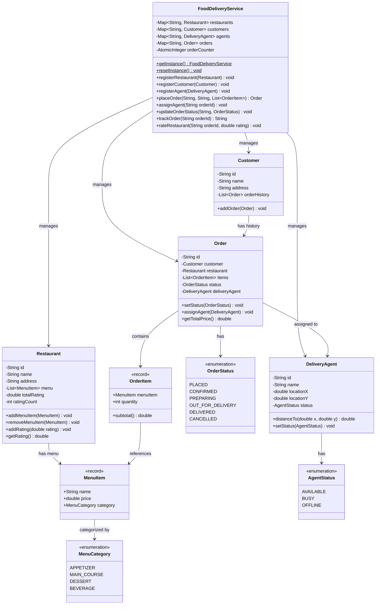

# Food Delivery System

## Problem Statement
Design a food delivery system that manages restaurants with menus, customers placing orders, delivery agent assignment and tracking, order lifecycle management, and restaurant ratings.

## Requirements
- Restaurant registration with menu management (add/remove items by category)
- Customer registration with order history tracking
- Order placement with menu validation and total price calculation
- Delivery agent registration with location tracking and nearest-agent assignment
- Order lifecycle: PLACED → CONFIRMED → PREPARING → OUT_FOR_DELIVERY → DELIVERED (or CANCELLED)
- Terminal state enforcement — no status changes after DELIVERED or CANCELLED
- Restaurant rating (1.0–5.0) only after delivery
- Agent availability management (AVAILABLE, BUSY, OFFLINE)
- Immutable collections returned from getters (unmodifiable lists)

## Key Design Decisions
- **Singleton pattern** — `FoodDeliveryService` uses `getInstance()` with `resetInstance()` for testing
- **Record types** — `MenuItem` and `OrderItem` are immutable records for value semantics
- **Nearest-agent dispatch** — Euclidean distance from agent location to restaurant
- **State machine** — `Order.setStatus()` prevents transitions from terminal states (DELIVERED/CANCELLED)
- **AtomicInteger** — thread-safe order ID generation (`ORD-1`, `ORD-2`, ...)
- **Cumulative rating** — Restaurant tracks `totalRating` and `ratingCount` for running average

## Class Diagram

## Design Benefits
- ✅ **Singleton** — single point of access for the delivery service
- ✅ **State machine** — terminal state enforcement prevents invalid lifecycle transitions
- ✅ **Nearest-agent dispatch** — optimal delivery assignment based on proximity
- ✅ **Immutable records** — `MenuItem` and `OrderItem` prevent mutation of order details
- ✅ **Unmodifiable collections** — defensive copies protect internal state
- ✅ **Cumulative rating** — efficient O(1) running average calculation

## Potential Discussion Points
- How would you add real-time GPS tracking for delivery agents?
- How to implement estimated delivery time calculation?
- How to handle surge pricing during peak hours?
- How would you add promotion/coupon support?
- How to scale for millions of concurrent orders?
- How to implement order cancellation with refund logic?
