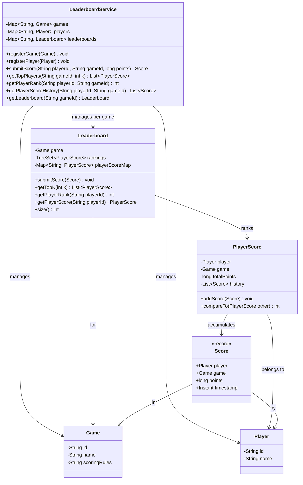

# Game Leaderboard

## Problem Statement
Design a game leaderboard system that manages multiple games and players, supports score submission with history tracking, top-K ranking queries, player rank lookups, and thread-safe concurrent operations.

## Requirements
- Register games with scoring rules and players with unique IDs
- Submit scores for players in specific games; scores accumulate over multiple submissions
- Top-K leaderboard queries per game (sorted by total points descending)
- Player rank lookup (1-based) within a game
- Full score history per player per game
- Thread-safe concurrent score submissions
- Immutable/unmodifiable return types

## Key Design Decisions
- **TreeSet for rankings** — O(log n) insertion, removal, and ordered traversal for top-K queries
- **HashMap for player lookup** — O(1) access to `PlayerScore` by player ID
- **Remove-then-reinsert on TreeSet** — score updates require removing the entry, mutating, and re-inserting to maintain sort order
- **PlayerScore implements Comparable** — descending by total points, ascending by player ID for deterministic ties
- **ConcurrentHashMap** — thread-safe maps in `LeaderboardService` for game/player/leaderboard lookup
- **Synchronized Leaderboard** — all mutating and query operations on a per-game `Leaderboard` are synchronized
- **Immutable Score record** — each submission is a timestamped value object

## Class Diagram

## Design Benefits
- ✅ **O(log n) ranking** — TreeSet maintains sorted order efficiently
- ✅ **Thread-safe** — synchronized Leaderboard + ConcurrentHashMap in service layer
- ✅ **Score history** — full audit trail of every submission with timestamps
- ✅ **Deterministic ordering** — Comparable implementation breaks ties by player ID
- ✅ **Immutable Score record** — submissions cannot be modified after creation
- ✅ **Multi-game support** — each game has its own independent leaderboard

## Potential Discussion Points
- How would you implement real-time leaderboard updates with WebSocket notifications?
- How to handle leaderboard resets (daily/weekly/seasonal)?
- How to scale to millions of players with sharding?
- How to implement percentile-based ranking (top 1%, top 10%)?
- How to prevent score manipulation or cheating?
- What if you need O(1) rank lookup instead of O(n)?
