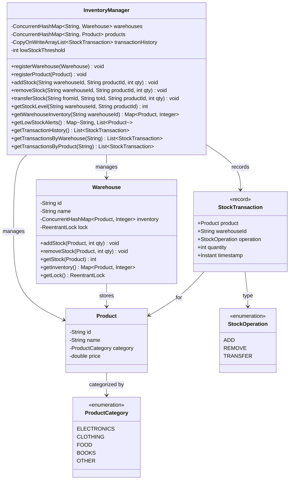

# Inventory Management System (Multithreaded)

## Problem Statement
Design a multithreaded inventory management system with multiple warehouses, thread-safe stock operations, atomic inter-warehouse transfers with deadlock prevention, low-stock alerting, and full transaction history.

## Requirements
- Register products (with category and price) and warehouses
- Thread-safe stock add/remove operations per warehouse
- Atomic stock transfers between warehouses
- Deadlock prevention for concurrent bi-directional transfers
- Low-stock alerts based on configurable threshold
- Full transaction history with filtering by warehouse or product
- Fine-grained locking per warehouse (not a global lock)

## Key Design Decisions
- **ReentrantLock per Warehouse** — fine-grained locking avoids contention on unrelated warehouses
- **Deterministic lock ordering** — transfers lock warehouses in ID-sorted order to prevent deadlocks
- **ConcurrentHashMap for inventory** — thread-safe per-warehouse stock storage
- **CopyOnWriteArrayList for history** — append-only transaction log safe for concurrent reads
- **StockTransaction record** — immutable audit trail with product, warehouse, operation, quantity, and timestamp
- **StockOperation enum** — ADD, REMOVE, TRANSFER distinguish transaction types

## Class Diagram

## Design Benefits
- ✅ **Fine-grained locking** — ReentrantLock per warehouse minimizes contention
- ✅ **Deadlock-free transfers** — deterministic ID-based lock ordering
- ✅ **Atomic transfers** — both warehouses locked before any mutation
- ✅ **Full audit trail** — CopyOnWriteArrayList provides thread-safe transaction history
- ✅ **Low-stock alerts** — configurable threshold with per-warehouse product scanning
- ✅ **Stock conservation** — transfers are atomic, total stock across warehouses is preserved

## Potential Discussion Points
- How would you handle distributed inventory across data centers?
- How to implement batch operations (bulk stock updates)?
- How to add notification systems for low-stock events (Observer pattern)?
- How would you implement optimistic locking instead of pessimistic locks?
- How to handle stock reservations (soft locks for pending orders)?
- What happens when a transfer partially fails — how to implement compensating transactions?
