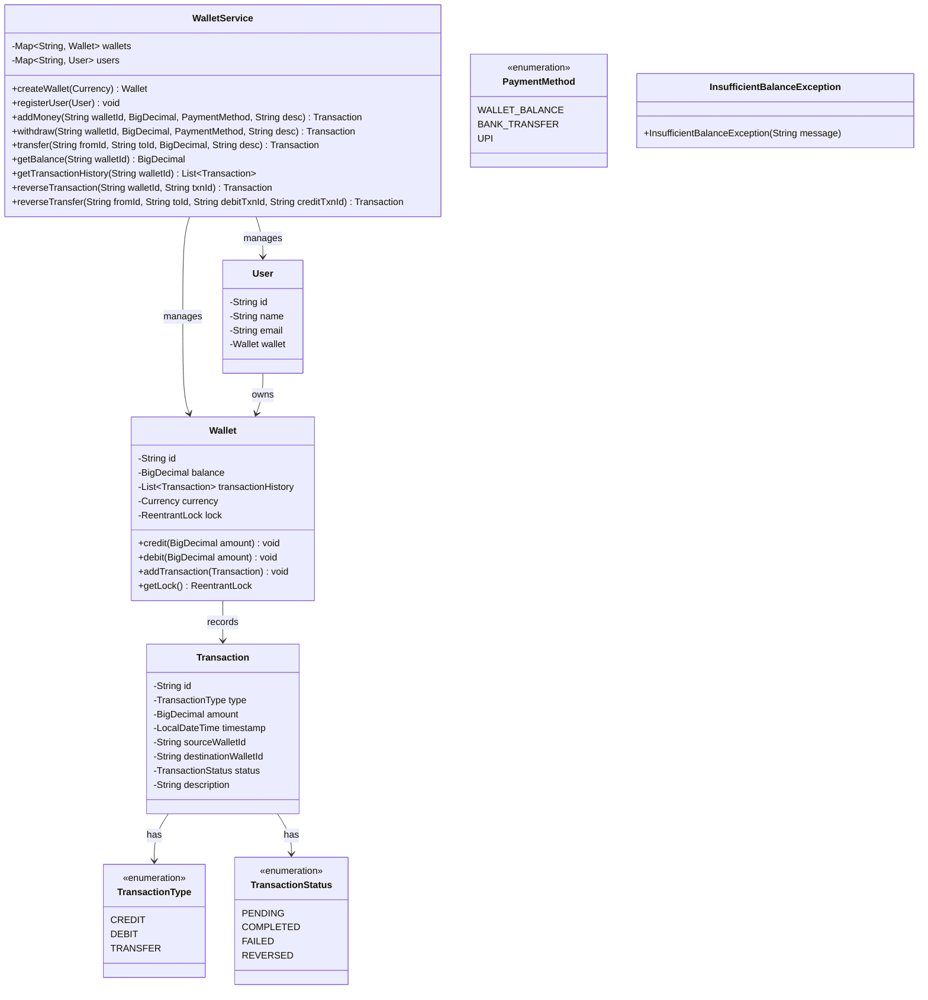

# Payment Wallet

## Problem Statement
Design a digital payment wallet system supporting deposits, withdrawals, atomic peer-to-peer transfers, transaction reversal, and concurrent operations — all with thread-safe balance management and deadlock prevention.

## Requirements
- Wallet creation with currency and user association
- Add money (credit) and withdraw (debit) with overdraft prevention
- Atomic peer-to-peer transfers between wallets
- Transaction history per wallet with status tracking (PENDING → COMPLETED/FAILED/REVERSED)
- Transaction reversal for credits, debits, and transfers
- Thread-safe concurrent deposits and transfers
- BigDecimal for precise monetary calculations
- Deadlock-free concurrent bi-directional transfers

## Key Design Decisions
- **ReentrantLock per Wallet** — fair lock for ordered thread scheduling; exposed via `getLock()` for service-layer coordination
- **Consistent lock ordering** — transfers lock wallets in ID-sorted order to prevent deadlocks
- **BigDecimal** — precise decimal arithmetic avoids floating-point rounding errors
- **Transaction status machine** — PENDING → COMPLETED/FAILED/REVERSED with volatile status for visibility
- **InsufficientBalanceException** — checked exception enforces callers to handle overdraft attempts
- **UUID-based IDs** — globally unique wallet and transaction identifiers
- **Reversal support** — both single-wallet and cross-wallet reversals mark originals as REVERSED

## Class Diagram

## Design Benefits
- ✅ **Precise arithmetic** — BigDecimal eliminates floating-point errors for money
- ✅ **Deadlock-free transfers** — consistent ID-based lock ordering
- ✅ **Fair locking** — ReentrantLock(true) prevents thread starvation
- ✅ **Transaction audit trail** — full history with status tracking per wallet
- ✅ **Reversal support** — both single-wallet and cross-wallet transaction reversals
- ✅ **Checked exception** — InsufficientBalanceException forces callers to handle overdraft
- ✅ **Money conservation** — atomic transfers preserve total balance across wallets

## Potential Discussion Points
- How would you add multi-currency support with exchange rates?
- How to implement daily transaction limits?
- How to add KYC (Know Your Customer) verification?
- How would you handle partial refunds?
- How to implement scheduled/recurring payments?
- How to audit and reconcile transactions across distributed services?
