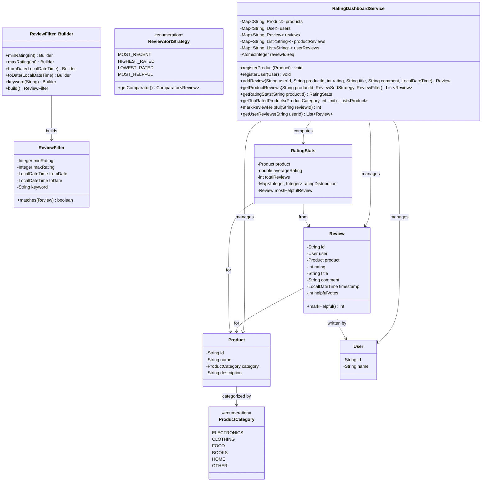

# Product Rating Dashboard

## Problem Statement
Design a product rating and review dashboard supporting review submission with duplicate prevention, multi-criteria sorting and filtering, rating statistics with distribution histograms, helpful vote tracking, top-rated product queries by category, and user review lookups.

## Requirements
- Register products (with category) and users
- Submit reviews (1–5 stars) with title, comment, and timestamp
- Prevent duplicate reviews (one review per user per product)
- Sort reviews by: most recent, highest rated, lowest rated, most helpful
- Filter reviews by: minimum/maximum rating, date range, keyword search (title + comment)
- Rating statistics: average rating, total reviews, 1–5 star distribution histogram, most helpful review
- Top-rated products per category
- Helpful vote tracking with increment

## Key Design Decisions
- **Strategy Pattern for sorting** — `ReviewSortStrategy` enum wraps a `Comparator<Review>` per strategy
- **Builder Pattern for filtering** — `ReviewFilter.Builder` provides fluent construction of multi-criteria filters
- **Duplicate prevention** — checks existing reviews by user+product before insertion
- **RatingStats as computed snapshot** — calculates average, distribution, and most helpful on demand from review list
- **ConcurrentHashMap** — thread-safe storage for products, users, and reviews
- **AtomicInteger** — thread-safe review ID generation
- **ProductCategory enum** — enables top-rated queries scoped by category

## Class Diagram

## Design Benefits
- ✅ **Strategy Pattern** — pluggable sort strategies with enum-wrapped comparators
- ✅ **Builder Pattern** — fluent, flexible filter construction with validation
- ✅ **Duplicate prevention** — one review per user per product enforced
- ✅ **Computed statistics** — RatingStats captures average, histogram, and most helpful in one object
- ✅ **Helpful votes** — community-driven review quality signals
- ✅ **Category-scoped queries** — top-rated products filtered by category

## Potential Discussion Points
- How would you add verified purchase badges?
- How to implement review moderation (flagging, admin approval)?
- How to handle review editing and versioning?
- How would you weight ratings by recency (time-decay)?
- How to implement sentiment analysis on review text?
- How to scale review storage and queries for millions of products?
