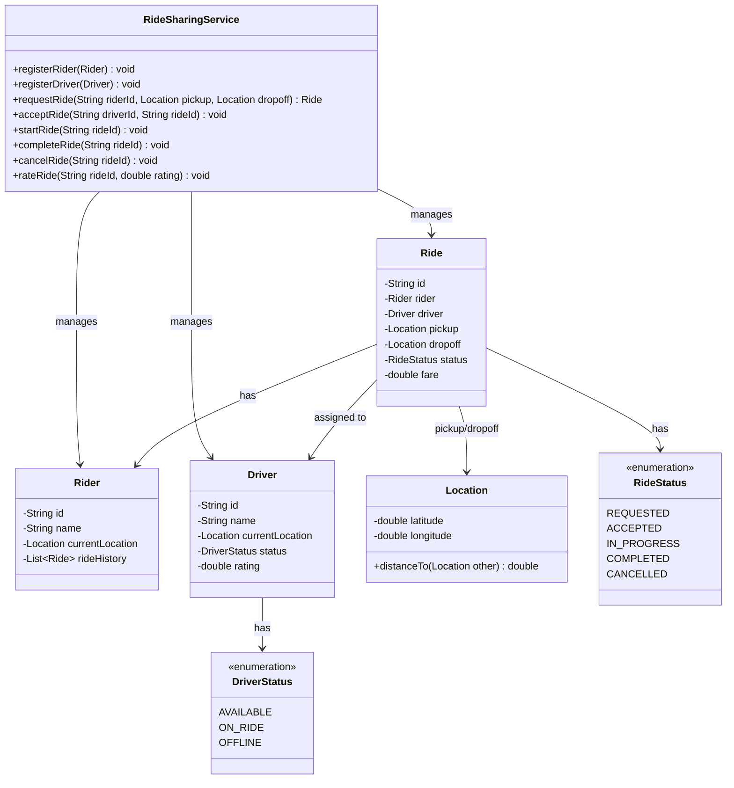

# Ride Sharing System

## Problem Statement
Design a ride-sharing system (like Uber/Lyft) that matches riders with nearby drivers, manages ride lifecycle, calculates fares, and tracks ride history.

## Requirements
- Rider and driver registration with location tracking
- Ride request matching with nearest available driver
- Ride lifecycle: REQUESTED → ACCEPTED → IN_PROGRESS → COMPLETED (or CANCELLED)
- Fare calculation based on distance
- Driver availability management
- Ride history for riders and drivers
- Rating system for riders and drivers

## Class Diagram

> **Note:** This project is currently a stub. The class diagram above represents a suggested design for implementation.

## Potential Discussion Points
- How to implement surge pricing based on demand?
- How to handle ride pooling (shared rides)?
- How to implement driver matching with ETA optimization?
- How to add payment integration?
- How to handle real-time location updates and route tracking?
