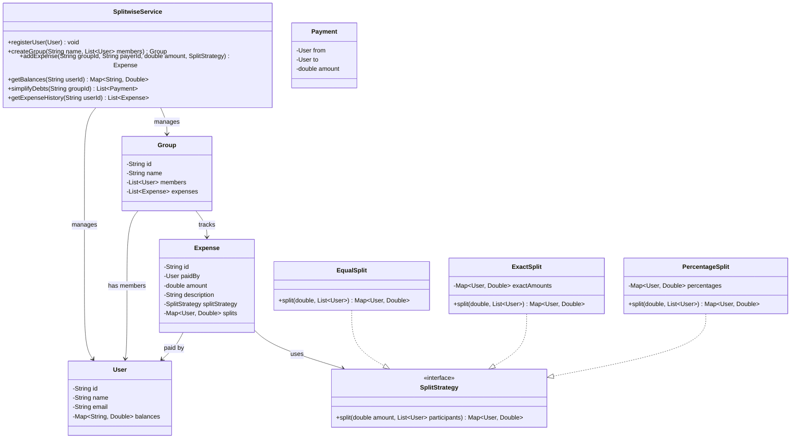

# Splitwise Application

## Problem Statement
Design an expense-splitting application (like Splitwise) that tracks shared expenses among groups of users, calculates balances, and simplifies debts.

## Requirements
- User registration and group management
- Add expenses with different split strategies (equal, exact, percentage)
- Track balances between pairs of users
- Simplify debts to minimize number of transactions
- Expense history per user and per group
- Support for multiple groups per user

## Class Diagram

> **Note:** This project is currently a stub. The class diagram above represents a suggested design for implementation.

## Potential Discussion Points
- How to implement debt simplification using a greedy algorithm?
- How to handle multi-currency expenses?
- How to add recurring expenses?
- How to implement settlement tracking (marking debts as paid)?
- How to handle unequal group sizes and partial participation?
