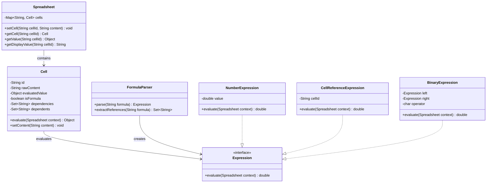

# Spreadsheet

## Problem Statement
Design a spreadsheet application that supports cell editing, formula evaluation with cell references, dependency tracking, and automatic recalculation when cells change.

## Requirements
- Grid of cells addressable by column-row notation (e.g., A1, B2)
- Cells can hold raw values (numbers, text) or formulas (e.g., `=A1+B2`)
- Formula evaluation with support for basic arithmetic and cell references
- Dependency tracking — cells that reference other cells
- Automatic recalculation when a referenced cell changes
- Circular dependency detection

## Class Diagram

> **Note:** This project is currently a stub. The class diagram above represents a suggested design for implementation.

## Potential Discussion Points
- How to implement topological sort for recalculation order?
- How to detect and handle circular dependencies?
- How to support range-based functions (SUM, AVERAGE)?
- How to implement undo/redo with the Memento pattern?
- How to handle concurrent edits in a collaborative spreadsheet?
