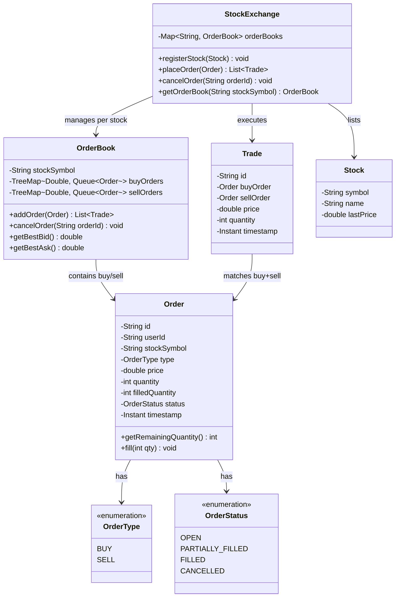

# Stock Exchange

## Problem Statement
Design a stock exchange system that supports order placement (buy/sell), order matching with price-time priority, trade execution, and order book management.

## Requirements
- User and stock registration
- Place buy and sell orders with price and quantity
- Order matching engine with price-time priority (best price first, then earliest)
- Partial order fills and remaining quantity tracking
- Trade execution with transaction records
- Order book display (aggregated buy/sell sides)
- Order cancellation

## Class Diagram

> **Note:** This project is currently a stub. The class diagram above represents a suggested design for implementation.

## Potential Discussion Points
- How to implement market orders (execute at best available price)?
- How to handle stop-loss and limit orders?
- How to add real-time price streaming?
- How to make the matching engine thread-safe for high throughput?
- How to implement circuit breakers (halt trading on extreme volatility)?
