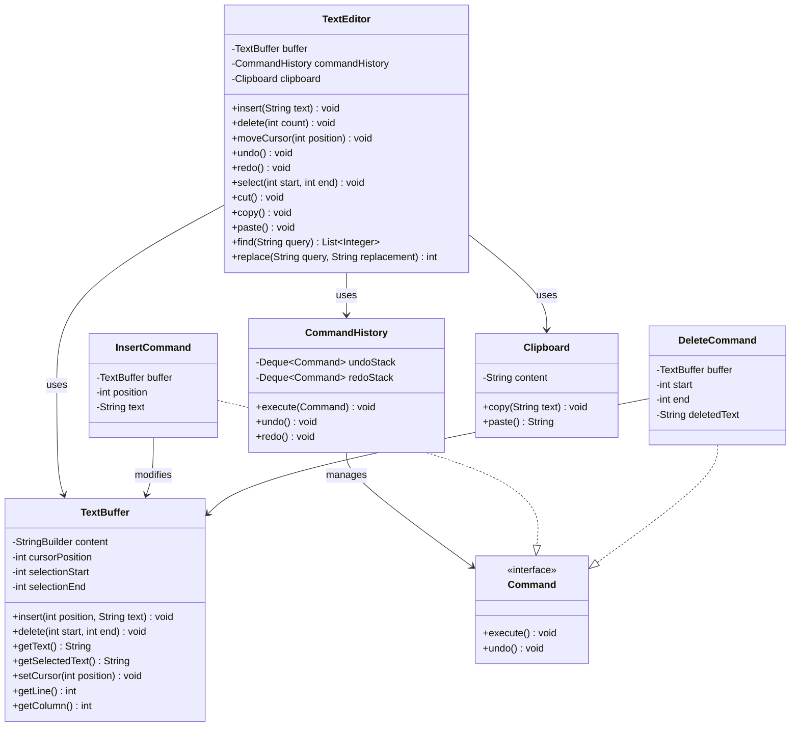

# Text Editor

## Problem Statement
Design a text editor that supports basic text operations (insert, delete, cursor movement), undo/redo functionality, clipboard operations (cut, copy, paste), and find/replace.

## Requirements
- Text buffer with cursor position tracking
- Insert and delete text at cursor
- Cursor movement (left, right, to position, to start/end)
- Undo/redo using Command pattern
- Clipboard operations (cut, copy, paste) with selection support
- Find and replace functionality
- Line and column tracking

## Class Diagram

> **Note:** This project is currently a stub. The class diagram above represents a suggested design for implementation.

## Potential Discussion Points
- How to implement syntax highlighting with the Visitor pattern?
- How to support multiple cursors?
- How to implement collaborative editing (operational transformation)?
- How to add macro recording and playback?
- How to efficiently handle large files (rope data structure)?
