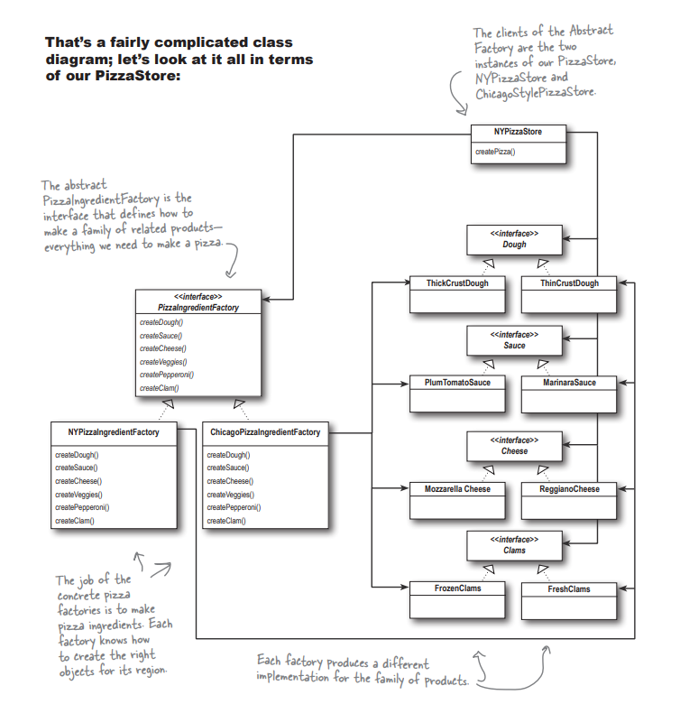
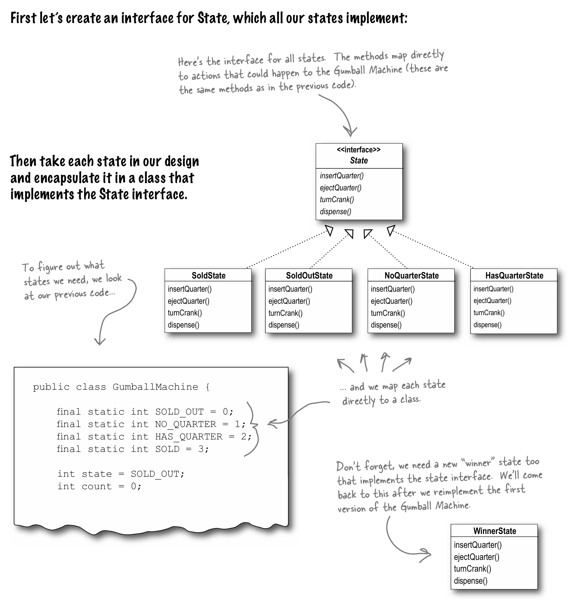

This project contains implementations of various design patterns in Java.

## Table of Contents

- [Table of Contents](#table-of-contents)
- [1. Strategy Pattern - Duck Simulator](#1-strategy-pattern---duck-simulator)
- [2. Observer Pattern - Weather Station](#2-observer-pattern---weather-station)
- [3. Decorator Pattern - Coffee House](#3-decorator-pattern---coffee-house)
- [4. Factory Pattern - Pizza Store](#4-factory-pattern---pizza-store)
- [5. Abstract Factory Pattern - Pizza Chain](#5-abstract-factory-pattern---pizza-chain)
- [6. Singleton Pattern - Chocolate Plant](#6-singleton-pattern---chocolate-plant)
- [7. Command Pattern - Remote Control](#7-command-pattern---remote-control)
- [8. Adapter Pattern - Ducks](#8-adapter-pattern---ducks)
- [9. Facade Pattern - Home Theatre](#9-facade-pattern---home-theatre)
- [10. Template Pattern - Barista](#10-template-pattern---barista)
- [11. Iterator Pattern - Merged Cafe](#11-iterator-pattern---merged-cafe)
- [12. Composite Pattern - Merged Cafe](#12-composite-pattern---merged-cafe)
- [13. State Pattern - Gumball Machine](#13-state-pattern---gumball-machine)
- [14. Bridge Pattern - TV Remote](#14-bridge-pattern---tv-remote)
- [15. Builder Pattern - House](#15-builder-pattern---house)
- [16. Chain of Responsibility Pattern](#16-chain-of-responsibility-pattern)
- [17. Flyweight Pattern - Trees](#17-flyweight-pattern---trees)
- [18. Interpreter Pattern](#18-interpreter-pattern)
- [19. Mediator Pattern](#19-mediator-pattern)
- [20. Memento Pattern](#20-memento-pattern)
- [21. Prototype Pattern - Game Monster](#21-prototype-pattern---game-monster)
- [22. Visitor Pattern](#22-visitor-pattern)
- [23. Proxy Pattern](#23-proxy-pattern)

### 1. Strategy Pattern - Duck Simulator

The Strategy Pattern defines a family of algorithms, encapsulates each one, and makes them interchangeable. Strategy lets the algorithm vary independently from clients that use it.

### 2. Observer Pattern - Weather Station

The Observer Pattern defines a one-to-many dependency between objects so that when one object changes state, all its dependents are notified and updated automatically

### 3. Decorator Pattern - Coffee House

Decorators attach additional responsibilities to objects dynamically. Decorators provide a flexible alternative to subclassing for extending functionality.

### 4. Factory Pattern - Pizza Store

The Factory Method Pattern defines an interface for creating an object, but lets subclasses decide which class to instantiate. Factory Method lets a class defer instantiation to subclasses. The Factory Method Pattern gives us a way to encapsulate the instantiations of concrete types.

The Factory Method pattern lets subclasses decide which class to instantiate. Because the Creator class is written without knowledge of the actual products that will be created, we say “decide” not because the pattern allows subclasses themselves to decide, but rather, because the decision actually comes down to which subclass is used to create the product.

This method is a direct derivative of "Dependency inversion principle" - which says "Depend upon abstractions. Do not depend upon concrete classes." In simpler words, it suggests that our high-level components should not depend on our low-level components; rather, they should both depend on abstractions and our Factory pattern allows us to do just that.

### 5. Abstract Factory Pattern - Pizza Chain

The Abstract Factory Pattern provides an interface for creating families of related or dependent objects without specifying their concrete classes.

Abstract Factory allows a client to use an abstract interface to create a set of related products without knowing (or caring) about the concrete products that are actually produced. In this way, the client is decoupled from any of the specifics of the concrete products.

Often the methods of an Abstract Factory are implemented as factory methods. It makes sense, right? The job of an Abstract Factory is to define an interface for creating a set of products. Each method in that interface is responsible for creating a concrete product, and we implement a subclass of the Abstract Factory to supply those implementations. So, factory methods are a natural way to
implement your product methods in your abstract factories.

Factory and abstract Factory coexist, the difference between Factory and Abstract factory is in the class definitions of the type they create. The initialization method for Factory is defined, whereas for Factory is abstract.

### 6. Singleton Pattern - Chocolate Plant

The Singleton Pattern ensures a class has only one instance, and provides a global point of access to it. The class' constructor is private.

We provide multiple implementations of the singleton pattern

- Simple: this is not thread safe as the creation can happen multiple times if two threads are initialized at the same time which can possibly create multiple instances of the singleton object.
- Synchronized
- Eagerly Created
- Enum
- Double checked locking

### 7. Command Pattern - Remote Control

The Command Pattern encapsulates a request as an object, thereby letting you parameterize other objects with different requests, queue or log requests, and support undoable operations.

### 8. Adapter Pattern - Ducks

The Adapter Pattern converts the interface of a class into another interface the clients expect.  Adapter lets classes work together that couldn’t otherwise because of incompatible interfaces. There are two types of adapters.

Enumerators vs Iterators are the best examples in Java for where adapter design pattern is used. (Enumerator is the old interface which doesn't support deletion)

Object adapters: with object adapter we pass requests to an Adaptee using Composition

Class adapters: with class adapter we subclass the Target and the Adaptee (multiple inheritance)

Object vs Class adapters:

### 9. Facade Pattern - Home Theatre

The Facade Pattern provides a unified interface to a set of interfaces in a subsytem. Facade defines a higher level interface that makes the subsystem easier to use.

A good facade pattern implementation follows the principle of least knowledge

### 10. Template Pattern - Barista

The Template Method defines the steps of an algorithm and allows subclasses to provide the implementation for one or more steps.
A good example is sorting algorithms (which use generics) and custom comparator functions (comparators are defined on custom objects to sort).

A hook is a method that is declared in the abstract class, but only given an empty or default implementation. This gives subclasses the ability to “hook into” the algorithm at various points, if they wish; a subclass is also free to ignore the hook. To use the hook, we override it in our subclass.

Template with hook:

Hook override in sub-class:

The hollywood principle in template pattern: High level components (super classes) call low level components (subclasses), not vice versa.

### 11. Iterator Pattern - Merged Cafe

The Iterator Pattern provides a way to access the elements of an aggregate object sequentially without exposing its underlying representation.

### 12. Composite Pattern - Merged Cafe

The Composite Pattern allows you to compose objects into tree structures to represent part-whole hierarchies. Composite lets clients treat individual objects and compositions of objects uniformly. (A hint of recursion in OOPS)

### 13. State Pattern - Gumball Machine

The State Pattern allows an object to alter its behavior when its internal state changes. The object will appear to change its class.

The state and strategy pattern are very similar - strategy encapsulates what changes, state encapsulates "state" which changes throughout the lifecycle of the object. Difference is that states decide what the next state should be, but in strategy pattern there usually isn't any change of one encapsulation to another (mallard duck doesn't change to rubber duck, etc.) so the context in which state and strategy are used are different.

### 14. Bridge Pattern - TV Remote

The Bridge Pattern allows you to vary the implementation and the abstraction by placing the two in separate class hierarchies.

### 15. Builder Pattern - House

Builder Pattern is used to encapsulate the construction of a product and allow it to be constructed in steps. The difference between Factory and Builder is the steps for constructing of the object is open for client, hence allowing more flexibility. Factory pattern encapsulates this in a method so it's very concrete.

### 16. Chain of Responsibility Pattern

Chain of Responsibility Pattern is used when you want to give more than one object a chance to handle a request.

### 17. Flyweight Pattern - Trees

Flyweight Pattern when one instance of a class can be used to provide many “virtual instances.” (Similar to singleton, but here client believes multiple objects were created)

### 18. Interpreter Pattern

Interpreter Pattern is used to build an interpreter for a language.

### 19. Mediator Pattern

Mediator Pattern to centralize complex communications and control between related objects. Similar to Facade but for in-between subsystem communication (Facade is used for Client to subsystem communication.)

Instead of each subsystem requiring to know about all other subsystems, only the Mediator has knowledge about all the subsystems.

### 20. Memento Pattern

Memento Pattern is used when you need to be able to return an object to one of its previous states; for instance, if your user requests an “undo.”

### 21. Prototype Pattern - Game Monster

Prototype Pattern is used when creating an instance of a given class is either expensive or complicated. The class implements an interface "Clonable" which has a ".clone", which replicates the entire state of the object.

### 22. Visitor Pattern

Visitor Pattern when you want to add capabilities to a composite of objects and encapsulation is not important. The require the composites to implement a getState() method which will expose the state to the Visitor which can implement the iterator accordingly (similar to custom iterations seen in the Iterator pattern).

### 23. Proxy Pattern

The Proxy Pattern provides a surrogate or placeholder for another object to control access to it.

Use the Proxy Pattern to create a representative object that controls access to another object, which may be:

- Remote
- Expensive to create
- In need of securing.

Proxy pattern:

The Protection Proxy - used in reflection

Terms to know:

- Stub: Client Helper (Intermediary on the Client side)
- Skeleton: Service Helper (Intermediary on the Remote Server object)

Popular usages of Proxy pattern:

- Remote Proxy: Acts as a local representative to a remote object. Eg: Remote Method Invocation (RMI), .NET remoting in c#
- Protection proxy: Controls access to resources based on access rights. (Java's Dynamic Proxy)
- Virtual Proxy: Controls access to a resource that is expensive to create.
- Firewall Proxy: Control access to a set of network resources, protecting subject from 'bad' clients.
- Smart Reference Proxy: Provides additional actions whenever a subject is referenced, such as counting the number of references to an object.
- Caching Proxy: Provides temporary storage for results of operations that are expensive. It can also allow multiple clients to share the results to reduce computation or network latency.
- Synchronization Proxy: Provides safe access to a subject from multiple threads.
- Complexity Hiding Proxy: Hides the complexity of and controls access to a complex set of classes. Otherwise called "Facade" proxy.
- Copy-On-Write Proxy: Controls the copying of an object by deferring the copying of an object until it is required by a client. This is a variant of the Virtual Proxy.

Proxy and Decorator look very similar, but in terms of usage - Proxy pattern is about access to an object whereas Decorator pattern is for modifying/enhancing functionality.

# Summary on Design Priniciples

1. Take what varies and “encapsulate” it so it won’t affect the rest of your code
2. Program to an interface, not an implementation
3. Favour composition over inheritance - HAS-A is better than IS-A
4. Strive for loosely coupled designs between objects that interact
5. Classes should be open for extension but closed for modification
6. Depend upon abstractions, do not depend upon concrete classes
7. Principle of Least Knowledge / The law of Demeter - talk only to your immediate friends
8. The Hollywood Principle: Don’t call us, we’ll call you. This is to prevent "Dependency Rot" (Low level components cannot call high level components)
